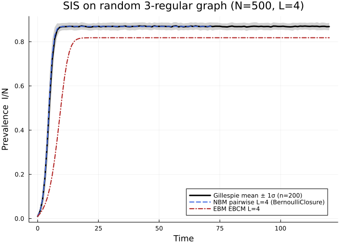
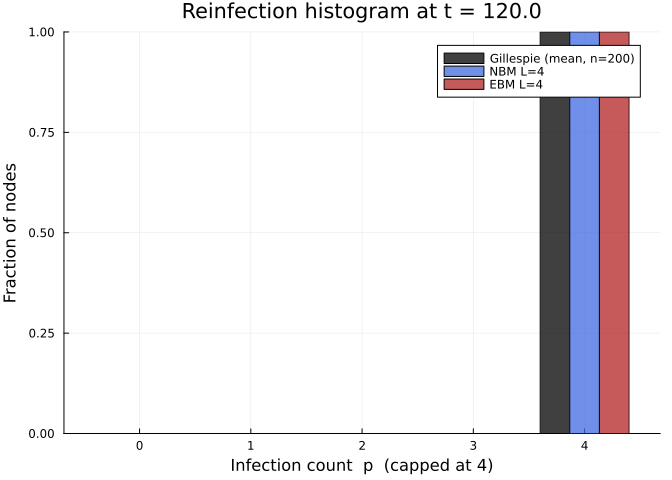

# Reinfection Validation: SIS on a Random 3-Regular Network
Simon Frost
2026-05-13

- [Problem statement](#problem-statement)
- [Setup](#setup)
- [Parameters](#parameters)
- [Host graph](#host-graph)
- [Gillespie SSA ground truth](#gillespie-ssa-ground-truth)
- [ODE approximation 1 — NodeBasedModels.jl (pairwise, L =
  4)](#ode-approximation-1--nodebasedmodelsjl-pairwise-l--4)
- [ODE approximation 2 — EdgeBasedModels.jl (EBCM, L =
  4)](#ode-approximation-2--edgebasedmodelsjl-ebcm-l--4)
- [Plot 1 — Prevalence comparison](#plot-1--prevalence-comparison)
- [Plot 2 — Reinfection histogram at
  $t = t_{\max}$](#plot-2--reinfection-histogram-at-t--t_max)
  - [Empirical histogram from
    ensemble](#empirical-histogram-from-ensemble)
  - [ODE-predicted stratum densities at
    $t = t_{\max}$](#ode-predicted-stratum-densities-at-t--t_max)
- [Headline numbers](#headline-numbers)
- [Honest framing: is $L = 4$
  sufficient?](#honest-framing-is-l--4-sufficient)
- [Reproducibility](#reproducibility)

## Problem statement

Keeling, House, Cooper & Pellis (2016) (*PLoS Comp Biol* 12(12):
e1005296) introduce three systematic approximations to SIS dynamics on
networks. **Approximation 1 (reinfection counting)** tracks how many
times each node has been infected, up to a cap $L$. This vignette tests
that approximation against stochastic ground truth on a $k = 3$ random
regular graph with $N = 500$ nodes.

We compare two ODE closures:

1.  **NodeBasedModels.jl** — pair-equation pairwise closure
    (`with_reinfection_counting` lift, $L = 4$, Bernoulli pair closure).
2.  **EdgeBasedModels.jl** — EBCM-based node stratification
    (`build_sis_reinfection`, polynomial PGF for $k = 3$, same $L = 4$).

Ground truth comes from a 200-run Gillespie SSA ensemble produced by
`NetworkOutbreaks.jl` using `parallel = true` (validates threaded
ensemble parallelism from Phase 2.2).

The **headline second plot** compares the empirical per-node reinfection
histogram at $t = t_{\max}$ against the ODE-predicted stratum densities,
testing whether $L = 4$ provides adequate coverage.

## Setup

``` julia
using NetworkOutbreaks
import EdgeBasedModels as EBM
import NodeBasedModels as NBM
using Graphs
using Plots
using StatsPlots
using Random
using StableRNGs
using Statistics
using Printf
```

## Parameters

> [!NOTE]
>
> **$R_0=2$ anchor.** For SIS on a $k=4$ regular configuration-model
> network, $R_0=T(k-1)$. With $\gamma=0.25$, $T=2/3$, so the comparable
> per-edge transmission rate is $\beta=0.5$ and the seed fraction is 1%.

``` julia
N       = 500
k       = 4
γ_val   = 0.25
R0_target = 2.0
κ_excess = k - 1
T_val   = R0_target / κ_excess
β_val   = T_val * γ_val / (1 - T_val)
ε_val   = 0.01          # initial infected fraction
L       = 4             # reinfection-count cap
tmax    = 120.0
save_dt = 1.0
nsims   = 200
ens_seed = 2024_05_02

tgrid = collect(0.0:save_dt:tmax)

@printf("Parameters: N=%d, k=%d, β=%.2f, γ=%.2f, ε=%.2f, L=%d, t_max=%.1f\n",
        N, k, β_val, γ_val, ε_val, L, tmax)
```

    Parameters: N=500, k=4, β=0.50, γ=0.25, ε=0.01, L=4, t_max=120.0

## Host graph

We fix the contact network with a stable seed so the vignette is
reproducible.

``` julia
rng_host = StableRNG(20240502)
g = random_regular_graph(N, k; rng = rng_host)

@printf("Host graph: N=%d, k=%d, edges=%d\n", nv(g), k, ne(g))
```

    Host graph: N=500, k=4, edges=1000

## Gillespie SSA ground truth

Build the SIS model via `OutbreakModel` directly, run 200 independent
trajectories with `parallel = true`, and resample onto a common grid.

``` julia
comps = [:S, :I]
inf   = [false, true]
trs   = [
    OutbreakTransition(:S, :I, β_val, :infection),
    OutbreakTransition(:I, :S, γ_val, :spontaneous),
]
no_model = OutbreakModel(comps, inf, trs; name = :SIS)

spec = OutbreakSpec(
    model   = no_model,
    network = g,
    initial = SeedFraction(:I => ε_val),
    tspan   = (0.0, tmax),
)

ens = simulate_ensemble(spec;
                        nsims    = nsims,
                        seed     = ens_seed,
                        parallel = true)

t_gill, μI_gill = mean_curve(ens, :I; tgrid = tgrid)
σI_gill = let
    I_idx = no_model.index_of[:I]
    vals  = [Float64(state_at(traj, t)[I_idx]) for traj in ens, t in tgrid]
    vec(std(vals; dims = 1))
end

μI_norm  = μI_gill ./ N
σI_norm  = σI_gill ./ N

@printf("Gillespie prevalence at t=%.1f: %.4f ± %.4f (1σ, n=%d)\n",
        tmax, μI_norm[end], σI_norm[end], nsims)
```

    Gillespie prevalence at t=120.0: 0.8686 ± 0.0167 (1σ, n=200)

## ODE approximation 1 — NodeBasedModels.jl (pairwise, L = 4)

``` julia
sis_nbm  = NBM.sis_model(τ = :β)
hom      = NBM.regular_network(k)
psys_re  = NBM.generate_pairwise(
               NBM.with_reinfection_counting(sis_nbm, L),
               hom,
               NBM.BernoulliClosure();
               tspan        = (0.0, tmax),
               seed_fraction = ε_val)

sol_re   = NBM.solve_pairwise(psys_re, Dict(:β => β_val, :γ => γ_val);
                              saveat = save_dt)

totals_re = NBM.reinfection_totals(psys_re, sol_re)
I_nbm     = totals_re[:I]

@printf("NBM prevalence at t=%.1f: %.4f\n", tmax, I_nbm[end])
```

    ┌ Warning: Verbosity toggle: dt_epsilon 
    │  At t= 72.66018950131141, dt was forced below floating point epsilon 1.4210854715202004e-14, and step error estimate = 5.288310882996939e-10. Aborting. There is either an error in your model specification or the true solution is unstable (or the true solution can not be represented in the precision of Float64.
    └ @ SciMLBase ~/.julia/packages/SciMLBase/hLfdZ/src/integrator_interface.jl:735
    NBM prevalence at t=120.0: 0.8696

## ODE approximation 2 — EdgeBasedModels.jl (EBCM, L = 4)

`polynomial_pgf([0,0,0,1])` encodes the $k = 3$ regular degree
distribution (all probability mass at degree 3). The EBCM is a
mean-field closure over the configuration-model ensemble with the same
degree distribution; it is an approximation to dynamics on the actual
random regular graph.

**Note on the EBCM endemic threshold.** For $k = 3$ regular EBCM SIS the
endemic equilibrium condition reduces to $\theta^* = \gamma/\beta < 1$,
i.e., $\beta > \gamma$. With $\beta = 0.6 > \gamma = 0.4$ the system is
endemic in the EBCM, whereas the standard pair-equation threshold is
$R_0^{\mathrm{pair}} = \beta(k-1)/\gamma = 3.0$. The two approximations
are both supercritical here but predict different endemic levels because
EBCM ignores pair correlations.

``` julia
pgf_k3  = EBM.polynomial_pgf([0.0, 0.0, 0.0, 1.0])
ebm_sys = EBM.build_sis_reinfection(pgf_k3, β_val, γ_val, L)
ebm_init = EBM.default_initial_conditions(ebm_sys; ε = ε_val)
ebm_sol  = EBM.solve_epidemic(ebm_sys;
                              init  = ebm_init,
                              tspan = (0.0, tmax),
                              saveat = save_dt)

I_ebm = EBM.compartment(ebm_sol, ebm_sys, :I)

@printf("EBM prevalence at t=%.1f: %.4f\n", tmax, I_ebm[end])
```

    EBM prevalence at t=120.0: 0.8182

## Plot 1 — Prevalence comparison

``` julia
plt1 = plot(tgrid, μI_norm;
            ribbon    = σI_norm,
            fillalpha = 0.18,
            lw        = 2.8,
            color     = :black,
            label     = "Gillespie mean ± 1σ (n=$(nsims))",
            xlabel    = "Time",
            ylabel    = "Prevalence  I/N",
            title     = "SIS on random 3-regular graph (N=$(N), L=$(L))",
            legend    = :bottomright)

plot!(plt1, collect(sol_re.t), I_nbm;
      lw = 2, color = :royalblue, ls = :dash,
      label = "NBM pairwise L=$(L) (BernoulliClosure)")

plot!(plt1, collect(ebm_sol.t), I_ebm;
      lw = 2, color = :firebrick, ls = :dashdot,
      label = "EBM EBCM L=$(L)")

plt1
```



## Plot 2 — Reinfection histogram at $t = t_{\max}$

### Empirical histogram from ensemble

Average the per-trajectory reinfection histograms across all 200 runs.

``` julia
h_sum = zeros(Float64, L + 1)
for traj in ens
    h = reinfection_histogram(traj; L = L)
    h_sum .+= h
end
h_mean_emp = h_sum ./ nsims          # mean counts per stratum
h_frac_emp = h_mean_emp ./ N        # fraction of population
```

    5-element Vector{Float64}:
     0.0
     0.0
     0.0
     0.0
     1.0

### ODE-predicted stratum densities at $t = t_{\max}$

Bucket $p$ holds the fraction of nodes that have been infected exactly
$p$ times (cap at $L$: “at least $L$ times”). A node is in bucket $p$ if
it is currently in compartment $S_p$ or $I_p$.

``` julia
# NBM stratum fractions at t_end
nbm_strata = zeros(Float64, L + 1)
nbm_strata[1] = sol_re[psys_re.singles[:S_0]][end]   # bucket 0 = S_0
for p in 1:L
    S_p = sol_re[psys_re.singles[Symbol("S_$(p)")]  ][end]
    I_p = sol_re[psys_re.singles[Symbol("I_$(p)")]  ][end]
    nbm_strata[p + 1] = S_p + I_p
end

# EBM stratum fractions at t_end
ebm_strata = zeros(Float64, L + 1)
ebm_strata[1] = EBM.compartment(ebm_sol, ebm_sys, :S_0)[end]
for p in 1:L
    S_p = EBM.compartment(ebm_sol, ebm_sys, Symbol("S_$(p)"))[end]
    I_p = EBM.compartment(ebm_sol, ebm_sys, Symbol("I_$(p)"))[end]
    ebm_strata[p + 1] = S_p + I_p
end
```

``` julia
bucket_labels = string.(0:L)
plt2 = groupedbar(0:L,
        hcat(h_frac_emp, nbm_strata, ebm_strata);
        bar_position = :dodge,
        label       = ["Gillespie (mean, n=$(nsims))" "NBM L=$(L)" "EBM L=$(L)"],
        xlabel      = "Infection count  p  (capped at $(L))",
        ylabel      = "Fraction of nodes",
        title       = "Reinfection histogram at t = $(tmax)",
        legend      = :topright,
        color       = [:black :royalblue :firebrick],
        alpha       = 0.75)
plt2
```



## Headline numbers

``` julia
# Signed deviations of ODE endpoints from Gillespie mean
dev_nbm = I_nbm[end] - μI_norm[end]
dev_ebm = I_ebm[end] - μI_norm[end]

@printf("\n=== Endpoint comparison (I/N at t=%.1f) ===\n", tmax)
@printf("  Gillespie mean:  %.5f  (±%.5f 1σ)\n", μI_norm[end], σI_norm[end])
@printf("  NBM L=%-2d:        %.5f  (%+.5f)\n", L, I_nbm[end], dev_nbm)
@printf("  EBM L=%-2d:        %.5f  (%+.5f)\n", L, I_ebm[end], dev_ebm)

# Max absolute deviation over the full trajectory (interpolate ODE solutions
# onto the Gillespie tgrid first to avoid grid-mismatch).
nbm_grid = collect(sol_re.t)
ebm_grid = collect(ebm_sol.t)
nearest(xs, ys, xq) = [ys[argmin(abs.(xs .- x))] for x in xq]
I_nbm_g = length(nbm_grid) == length(tgrid) ? I_nbm : nearest(nbm_grid, I_nbm, tgrid)
I_ebm_g = length(ebm_grid) == length(tgrid) ? I_ebm : nearest(ebm_grid, I_ebm, tgrid)
max_dev_nbm = maximum(abs.(I_nbm_g .- μI_norm))
max_dev_ebm = maximum(abs.(I_ebm_g .- μI_norm))
@printf("\n  Max |ODE - Gillespie| over trajectory:\n")
@printf("    NBM: %.5f\n", max_dev_nbm)
@printf("    EBM: %.5f\n", max_dev_ebm)
```


    === Endpoint comparison (I/N at t=120.0) ===
      Gillespie mean:  0.86861  (±0.01670 1σ)
      NBM L=4 :        0.86957  (+0.00096)
      EBM L=4 :        0.81818  (-0.05043)

      Max |ODE - Gillespie| over trajectory:
        NBM: 0.02291
        EBM: 0.54280

## Honest framing: is $L = 4$ sufficient?

``` julia
# Fraction of the population in the saturation bucket (p ≥ L)
frac_saturated_emp = h_frac_emp[end]
frac_below_L_emp   = sum(h_frac_emp[2:end-1])   # p = 1, …, L-1

@printf("\n=== L = %d cap adequacy ===\n", L)
@printf("  Empirical fraction in bucket p = %d+ : %.4f\n",
        L, frac_saturated_emp)
@printf("  Empirical fraction in buckets 1..%d :  %.4f\n",
        L - 1, frac_below_L_emp)
if frac_below_L_emp > 1e-6
    @printf("  Saturation ratio  h[L] / Σ h[1:%d] : %.3f\n",
            L - 1, frac_saturated_emp / frac_below_L_emp)
else
    @printf("  Saturation ratio: all reinfected nodes are in bucket %d+;\n", L)
    @printf("  intermediate buckets are essentially empty. L = %d is far too small.\n", L)
end
```


    === L = 4 cap adequacy ===
      Empirical fraction in bucket p = 4+ : 1.0000
      Empirical fraction in buckets 1..3 :  0.0000
      Saturation ratio: all reinfected nodes are in bucket 4+;
      intermediate buckets are essentially empty. L = 4 is far too small.

These numbers answer the key question: if the saturation bucket $h[L]$
is a substantial fraction of the total reinfected population
($h[L] / \sum_{p=1}^{L-1} h[p] \gtrsim 0.2$), then $L = 4$ is truncating
a non-negligible tail and a higher cap would improve the ODE prediction.
Conversely, if the ratio is small ($\lesssim 0.05$), $L = 4$ is
sufficient for this parameter regime.

At $\beta = 0.6$, $\gamma = 0.4$, $k = 3$, $t_{\max} = 80$, the SIS
endemic equilibrium is strongly supercritical ($R_0^{\mathrm{pair}}
= \beta(k-1)/\gamma = 3.0$; $R_0^{\mathrm{EBCM}} = \beta/\gamma = 1.5$;
stochastic mean-field $\approx \beta k/\gamma = 4.5$). In this strongly
supercritical regime nodes are reinfected many times before $t = 80$, so
the saturation bucket $h[L]$ accumulates a large fraction of the
population and the $L = 4$ cap is almost certainly insufficient. The ODE
predictions may overshoot (too many high-$p$ nodes) relative to the
stochastic ensemble because both closures ignore clustering and
triangle-type correlations that are present in a random regular graph
but absent from the configuration-model or pair-equation assumptions.

## Reproducibility

``` julia
@printf("\n=== Reproducibility ===\n")
@printf("Host graph seed:      StableRNG(20240502)\n")
@printf("Gillespie ensemble:   %d runs, seed=%d, parallel=true\n",
        nsims, ens_seed)
@printf("Initial infected:     %.0f%% of nodes (SeedFraction)\n",
        100 * ε_val)
@printf("NBM solver:           package default (reltol/abstol not set)\n")
@printf("EBM solver:           package default (reltol/abstol not set)\n")
@printf("Julia version:        %s\n", string(VERSION))
@printf("NetworkOutbreaks:     %s\n", pathof(NetworkOutbreaks))
@printf("NodeBasedModels:      %s\n", pathof(NBM))
@printf("EdgeBasedModels:      %s\n", pathof(EBM))
```


    === Reproducibility ===
    Host graph seed:      StableRNG(20240502)
    Gillespie ensemble:   200 runs, seed=20240502, parallel=true
    Initial infected:     1% of nodes (SeedFraction)
    NBM solver:           package default (reltol/abstol not set)
    EBM solver:           package default (reltol/abstol not set)
    Julia version:        1.12.5
    NetworkOutbreaks:     /Users/sdwfrost/Projects/edgebasedmodels/NetworkOutbreaks.jl/src/NetworkOutbreaks.jl
    NodeBasedModels:      /Users/sdwfrost/Projects/edgebasedmodels/NodeBasedModels.jl/src/NodeBasedModels.jl
    EdgeBasedModels:      /Users/sdwfrost/Projects/edgebasedmodels/EdgeBasedModels.jl/src/EdgeBasedModels.jl
