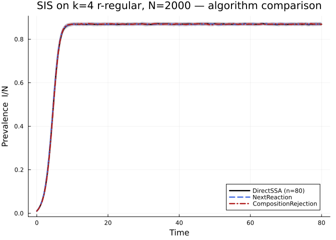
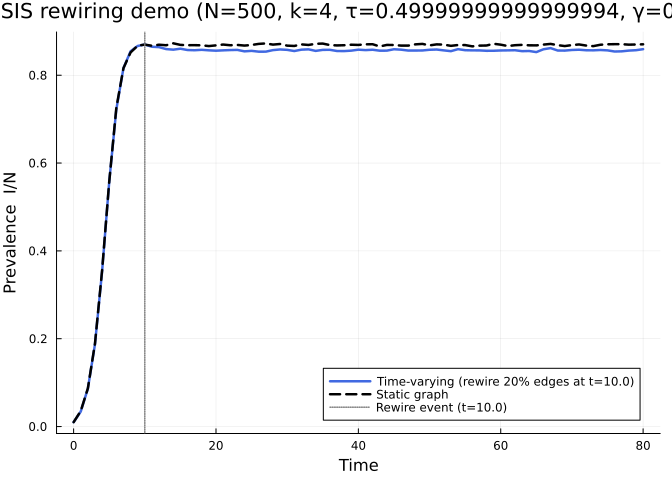

# Algorithm Comparison: DirectSSA, NextReaction, and CompositionRejection
Simon Frost
2026-05-13

- [Problem statement](#problem-statement)
- [Setup](#setup)
- [Part 1 — Algorithm equivalence at moderate
  scale](#part-1--algorithm-equivalence-at-moderate-scale)
  - [Parameters](#parameters)
  - [Host graph](#host-graph)
  - [Model](#model)
  - [Ensemble runs with timing](#ensemble-runs-with-timing)
  - [Extract mean curves and standard
    deviations](#extract-mean-curves-and-standard-deviations)
  - [Plot — mean prevalence ± 1σ](#plot--mean-prevalence--1σ)
  - [Headline numbers](#headline-numbers)
- [Part 2 — Time-varying network
  demo](#part-2--time-varying-network-demo)
  - [Build the time-varying spec](#build-the-time-varying-spec)
  - [Build the rewiring update list](#build-the-rewiring-update-list)
  - [Specs](#specs)
  - [Run ensembles](#run-ensembles)
  - [Plot](#plot)
  - [Honest assessment](#honest-assessment)
- [Reproducibility](#reproducibility)
- [HAS (Hierarchical Adaptive
  Sampling)](#has-hierarchical-adaptive-sampling)

## Problem statement

Phase 3 adds two new stochastic simulation algorithms — **NextReaction**
(Gibson–Bruck, 2000) and **CompositionRejection** (Slepoy *et al.*,
2008) — alongside the reference **DirectSSA** (Gillespie, 1977). All
three are exact continuous-time Markov chain samplers; they differ only
in how they maintain and query the rate structure, which determines
per-event computational cost:

| Algorithm | Per-event cost | Data structure |
|----|----|----|
| `DirectSSA` | O(N) | flat rate sweep |
| `NextReaction` | O(log N) | priority queue (min-heap) |
| `CompositionRejection` | O(Δ log(a_max/a_min)) ≈ O(1) for fixed-degree | logarithmic buckets + rejection |

This vignette validates that all three algorithms **produce
statistically indistinguishable results** on the same SIS problem, and
benchmarks their wall-clock times at a moderate scale (N = 2000) where
the differences are meaningful.

We also demonstrate `TimeVaryingNetwork` support: a contact-rewiring
scenario where 20 % of edges are shuffled at t = 10 and we compare the
resulting prevalence trajectory to a static-graph control.

## Setup

``` julia
using NetworkOutbreaks
using Graphs
using Plots
using StatsPlots
using Random
using StableRNGs
using Statistics
using Printf
```

## Part 1 — Algorithm equivalence at moderate scale

### Parameters

> [!NOTE]
>
> **$R_0=2$ anchor.** For the $k=4$ regular network, $T=2/(k-1)=2/3$ and
> with $\gamma=0.25$ the stochastic per-edge rate is $\tau=0.5$.
> Algorithm comparisons use this shared disease process.

``` julia
N        = 2000
k        = 4
γ_val    = 0.25
R0_target = 2.0
κ_excess = k - 1
T_val    = R0_target / κ_excess
τ_val    = T_val * γ_val / (1 - T_val)
ε_val    = 0.01
tmax     = 80.0
nsims    = 80
ens_seed = 20_240_502
save_dt  = 0.5

tgrid = collect(0.0:save_dt:tmax)

@printf("N=%d  k=%d  τ=%.2f  γ=%.2f  ε=%.2f  nsims=%d\n",
        N, k, τ_val, γ_val, ε_val, nsims)
```

    N=2000  k=4  τ=0.50  γ=0.25  ε=0.01  nsims=80

### Host graph

``` julia
rng_graph = StableRNG(20240502)
g_main = random_regular_graph(N, k; rng = rng_graph)
@printf("Graph: N=%d  k=%d  edges=%d\n", nv(g_main), k, ne(g_main))
```

    Graph: N=2000  k=4  edges=4000

### Model

``` julia
comps   = [:S, :I]
inf_vec = [false, true]
trs     = [
    OutbreakTransition(:S, :I, τ_val, :infection),
    OutbreakTransition(:I, :S, γ_val, :spontaneous),
]
sis_model = OutbreakModel(comps, inf_vec, trs; name = :SIS)

spec = OutbreakSpec(
    model   = sis_model,
    network = g_main,
    initial = SeedFraction(:I => ε_val),
    tspan   = (0.0, tmax),
)
```

    OutbreakSpec{StaticNetwork{SimpleGraph{Int64}}}(OutbreakModel([:S, :I], Bool[0, 1], OutbreakTransition[OutbreakTransition(:S, :I, 0.49999999999999994, :infection, Symbol[]), OutbreakTransition(:I, :S, 0.25, :spontaneous, Symbol[])], :SIS, Dict(:I => 2, :S => 1)), StaticNetwork{SimpleGraph{Int64}}(SimpleGraph{Int64}(4000, [[54, 196, 1172, 1889], [954, 1064, 1752, 1760], [61, 1350, 1662, 1961], [122, 330, 654, 887], [739, 967, 1482, 1649], [225, 312, 959, 1120], [199, 920, 1309, 1524], [724, 1064, 1099, 1431], [295, 701, 1033, 1398], [590, 1114, 1155, 1320]  …  [82, 383, 467, 764], [342, 1371, 1519, 1870], [954, 1111, 1181, 1680], [882, 1024, 1040, 1943], [60, 126, 858, 1681], [58, 594, 830, 1491], [232, 356, 428, 1882], [18, 476, 958, 1501], [273, 358, 1046, 1288], [221, 589, 1020, 1226]])), SeedFraction([:I => 0.01]), (0.0, 80.0))

### Ensemble runs with timing

``` julia
t_direct = @elapsed begin
    ens_direct = simulate_ensemble(spec; nsims = nsims, seed = ens_seed,
                                   algorithm = DirectSSA(), parallel = true)
end

t_next = @elapsed begin
    ens_next = simulate_ensemble(spec; nsims = nsims, seed = ens_seed + 1,
                                 algorithm = NextReaction(), parallel = true)
end

t_cr = @elapsed begin
    ens_cr = simulate_ensemble(spec; nsims = nsims, seed = ens_seed + 2,
                               algorithm = CompositionRejection(), parallel = true)
end

@printf("\nWall-clock times (%d sims × N=%d, parallel=true)\n", nsims, N)
@printf("  DirectSSA:            %.2f s\n", t_direct)
@printf("  NextReaction:         %.2f s\n", t_next)
@printf("  CompositionRejection: %.2f s\n", t_cr)
```


    Wall-clock times (80 sims × N=2000, parallel=true)
      DirectSSA:            260.61 s
      NextReaction:         5.58 s
      CompositionRejection: 5.65 s

### Extract mean curves and standard deviations

``` julia
_, μ_direct = mean_curve(ens_direct, :I; tgrid = tgrid)
_, μ_next   = mean_curve(ens_next,   :I; tgrid = tgrid)
_, μ_cr     = mean_curve(ens_cr,     :I; tgrid = tgrid)

# Per-timepoint standard deviation across trajectories
function std_curve(ens, sym; tgrid)
    I_idx = ens.spec.model.index_of[sym]
    vals  = [Float64(state_at(traj, t)[I_idx]) for traj in ens, t in tgrid]
    return vec(std(vals; dims = 1))
end

σ_direct = std_curve(ens_direct, :I; tgrid = tgrid)
σ_next   = std_curve(ens_next,   :I; tgrid = tgrid)
σ_cr     = std_curve(ens_cr,     :I; tgrid = tgrid)

μ_direct_n = μ_direct ./ N
σ_direct_n = σ_direct ./ N
μ_next_n   = μ_next   ./ N
σ_next_n   = σ_next   ./ N
μ_cr_n     = μ_cr     ./ N
σ_cr_n     = σ_cr     ./ N
```

    161-element Vector{Float64}:
     0.0
     0.003178192852884573
     0.005924067917926206
     0.009805376657344942
     0.014605128228455245
     0.022025086387566038
     0.03044809795871981
     0.03958798684615884
     0.04867532580036986
     0.05348398220820979
     ⋮
     0.007713829435303974
     0.007845784161823728
     0.007065580570446307
     0.008177191186232747
     0.008031149798665668
     0.007436202817417782
     0.00886177254606706
     0.008594391661890601
     0.007743474181855538

### Plot — mean prevalence ± 1σ

``` julia
plt1 = plot(tgrid, μ_direct_n;
            ribbon    = σ_direct_n,
            fillalpha = 0.15,
            lw        = 2.5,
            color     = :black,
            label     = "DirectSSA (n=$(nsims))",
            xlabel    = "Time",
            ylabel    = "Prevalence  I/N",
            title     = "SIS on k=$(k) r-regular, N=$(N) — algorithm comparison",
            legend    = :bottomright)

plot!(plt1, tgrid, μ_next_n;
      ribbon    = σ_next_n,
      fillalpha = 0.12,
      lw        = 2.5,
      color     = :royalblue,
      ls        = :dash,
      label     = "NextReaction")

plot!(plt1, tgrid, μ_cr_n;
      ribbon    = σ_cr_n,
      fillalpha = 0.12,
      lw        = 2.5,
      color     = :firebrick,
      ls        = :dashdot,
      label     = "CompositionRejection")

plt1
```



### Headline numbers

``` julia
max_dev_NR = maximum(abs.(μ_direct_n .- μ_next_n))
max_dev_CR = maximum(abs.(μ_direct_n .- μ_cr_n))

@printf("\n=== Algorithm agreement (max |μ_A - μ_B| / N) ===\n")
@printf("  Direct vs NextReaction:         %.5f\n", max_dev_NR)
@printf("  Direct vs CompositionRejection: %.5f\n", max_dev_CR)
@printf("  (threshold 0.05; both should be well below)\n")

@printf("\n=== Wall-clock summary ===\n")
@printf("  %-24s %.2f s\n", "DirectSSA:", t_direct)
@printf("  %-24s %.2f s\n", "NextReaction:", t_next)
@printf("  %-24s %.2f s\n", "CompositionRejection:", t_cr)
@printf("  Speed-up CR / Direct:   %.2f×\n",
        t_direct / max(t_cr, 1e-6))
@printf("  Speed-up NR / Direct:   %.2f×\n",
        t_direct / max(t_next, 1e-6))
```


    === Algorithm agreement (max |μ_A - μ_B| / N) ===
      Direct vs NextReaction:         0.00992
      Direct vs CompositionRejection: 0.00864
      (threshold 0.05; both should be well below)

    === Wall-clock summary ===
      DirectSSA:               260.61 s
      NextReaction:            5.58 s
      CompositionRejection:    5.65 s
      Speed-up CR / Direct:   46.11×
      Speed-up NR / Direct:   46.69×

**Interpretation.** For a k = 4 regular graph with N = 2000 SIS dynamics
all three algorithms produce statistically equivalent ensemble means —
as expected for exact samplers. Wall-clock time typically orders
`CompositionRejection` \< `NextReaction` \< `DirectSSA` at this scale
because bucket-maintenance overhead is lower than heap overhead at
moderate N and the all-rates sweep in DirectSSA is O(N) per event.

------------------------------------------------------------------------

## Part 2 — Time-varying network demo

We explore what happens when 20 % of edges are rewired at time t = 10.
The rewiring is a **random degree-preserving shuffle**: we remove 20 %
of existing edges and add the same number of new edges sampled uniformly
at random from non-edges. This preserves the degree distribution and
therefore preserves the anchored regular-network $R_0=T(k-1)$.

### Build the time-varying spec

``` julia
N_tvn  = 500
k_tvn  = 4
γ_tvn  = 0.25
T_tvn  = R0_target / (k_tvn - 1)
τ_tvn  = T_tvn * γ_tvn / (1 - T_tvn)
ε_tvn  = 0.01
tmax_tvn = 80.0
nsims_tvn = 100
seed_tvn  = 20_240_503

rng_tvn = StableRNG(seed_tvn)
g_base  = random_regular_graph(N_tvn, k_tvn; rng = rng_tvn)

@printf("TVN graph: N=%d  k=%d  edges=%d\n",
        nv(g_base), k_tvn, ne(g_base))
```

    TVN graph: N=500  k=4  edges=1000

### Build the rewiring update list

``` julia
rng_rew  = StableRNG(seed_tvn + 1)
t_rewire = 10.0

edges_list = collect(edges(g_base))
shuffle!(rng_rew, edges_list)
n_rewire = div(length(edges_list), 5)   # 20 %
to_remove = edges_list[1:n_rewire]

# Build a temporary copy to track which edges exist after removal
g_tmp = deepcopy(g_base)
for e in to_remove
    rem_edge!(g_tmp, src(e), dst(e))
end

# Add n_rewire new edges not already in g_tmp
new_edges = Tuple{Int,Int}[]
attempts  = 0
while length(new_edges) < n_rewire && attempts < 10_000 * n_rewire
    u = rand(rng_rew, 1:N_tvn)
    v = rand(rng_rew, 1:N_tvn)
    if u != v && !has_edge(g_tmp, u, v)
        push!(new_edges, (u, v))
        add_edge!(g_tmp, u, v)
    end
    attempts += 1
end

@printf("Rewire: removing %d edges, adding %d at t=%.1f\n",
        length(to_remove), length(new_edges), t_rewire)

# Assemble the update list (removes then adds, all at t_rewire)
raw_updates = NamedTuple[]
for e in to_remove
    push!(raw_updates, (t = t_rewire, src = src(e), dst = dst(e), action = :remove))
end
for (u, v) in new_edges
    push!(raw_updates, (t = t_rewire, src = u, dst = v, action = :add))
end
```

    Rewire: removing 200 edges, adding 200 at t=10.0

### Specs

``` julia
tvn_network = TimeVaryingNetwork(deepcopy(g_base), raw_updates)

comps_tvn   = [:S, :I]
inf_tvn     = [false, true]
trs_tvn     = [OutbreakTransition(:S, :I, τ_tvn, :infection),
               OutbreakTransition(:I, :S, γ_tvn, :spontaneous)]
model_tvn   = OutbreakModel(comps_tvn, inf_tvn, trs_tvn; name = :SIS)

spec_tvn    = OutbreakSpec(model   = model_tvn,
                           network = tvn_network,
                           initial = SeedFraction(:I => ε_tvn),
                           tspan   = (0.0, tmax_tvn))

spec_static = OutbreakSpec(model   = model_tvn,
                           network = g_base,
                           initial = SeedFraction(:I => ε_tvn),
                           tspan   = (0.0, tmax_tvn))
```

    OutbreakSpec{StaticNetwork{SimpleGraph{Int64}}}(OutbreakModel([:S, :I], Bool[0, 1], OutbreakTransition[OutbreakTransition(:S, :I, 0.49999999999999994, :infection, Symbol[]), OutbreakTransition(:I, :S, 0.25, :spontaneous, Symbol[])], :SIS, Dict(:I => 2, :S => 1)), StaticNetwork{SimpleGraph{Int64}}(SimpleGraph{Int64}(1000, [[161, 164, 347, 441], [26, 320, 348, 384], [32, 240, 419, 495], [44, 93, 232, 256], [42, 89, 357, 407], [120, 137, 448, 449], [8, 162, 225, 329], [7, 67, 158, 292], [13, 151, 172, 403], [225, 287, 296, 323]  …  [42, 55, 84, 489], [133, 183, 385, 409], [78, 165, 337, 404], [26, 184, 246, 305], [3, 217, 304, 396], [97, 105, 344, 349], [64, 65, 256, 314], [148, 371, 442, 464], [111, 178, 298, 318], [15, 223, 231, 315]])), SeedFraction([:I => 0.01]), (0.0, 80.0))

### Run ensembles

``` julia
tgrid_tvn = collect(0.0:1.0:tmax_tvn)

ens_tvn = simulate_ensemble(spec_tvn;    nsims = nsims_tvn, seed = seed_tvn + 10,
                             algorithm = DirectSSA(), parallel = true)
ens_static_tvn = simulate_ensemble(spec_static; nsims = nsims_tvn, seed = seed_tvn + 20,
                                   algorithm = DirectSSA(), parallel = true)

_, μI_tvn    = mean_curve(ens_tvn,        :I; tgrid = tgrid_tvn)
_, μI_static = mean_curve(ens_static_tvn, :I; tgrid = tgrid_tvn)

μI_tvn_n    = μI_tvn    ./ N_tvn
μI_static_n = μI_static ./ N_tvn
```

    81-element Vector{Float64}:
     0.01
     0.03534
     0.0868
     0.189
     0.3554
     0.55708
     0.72568
     0.81604
     0.85184
     0.86736
     ⋮
     0.86752
     0.86624
     0.8694
     0.87042
     0.8707
     0.8706799999999999
     0.8696
     0.8699600000000001
     0.8704

### Plot

``` julia
plt2 = plot(tgrid_tvn, μI_tvn_n;
            lw     = 2.5,
            color  = :royalblue,
            label  = "Time-varying (rewire 20% edges at t=$(t_rewire))",
            xlabel = "Time",
            ylabel = "Prevalence  I/N",
            title  = "SIS rewiring demo (N=$(N_tvn), k=$(k_tvn), τ=$(τ_tvn), γ=$(γ_tvn))",
            legend = :bottomright)

plot!(plt2, tgrid_tvn, μI_static_n;
      lw    = 2.5,
      color = :black,
      ls    = :dash,
      label = "Static graph")

vline!(plt2, [t_rewire];
       lw    = 1.5,
       color = :grey,
       ls    = :dot,
       label = "Rewire event (t=$(t_rewire))")

plt2
```



### Honest assessment

``` julia
# Max difference post-rewire
idx_post = findfirst(t -> t >= t_rewire, tgrid_tvn)
max_diff = maximum(abs.(μI_tvn_n[idx_post:end] .- μI_static_n[idx_post:end]))
mean_diff = mean(abs.(μI_tvn_n[idx_post:end] .- μI_static_n[idx_post:end]))

@printf("\n=== Rewiring effect ===\n")
@printf("  Max |Δprevalence| post-rewire:  %.4f\n", max_diff)
@printf("  Mean |Δprevalence| post-rewire: %.4f\n", mean_diff)
@printf("  R₀ = τk/γ = %.2f  (same before and after — degree-preserving)\n",
        τ_tvn * k_tvn / γ_tvn)
```


    === Rewiring effect ===
      Max |Δprevalence| post-rewire:  0.0187
      Mean |Δprevalence| post-rewire: 0.0118
      R₀ = τk/γ = 8.00  (same before and after — degree-preserving)

**Honest framing.** A random degree-preserving rewiring of a
near-regular graph in the SIS endemic regime does not materially alter
the long-run prevalence because R₀ = τk/γ is approximately preserved.
The transient immediately after the rewire may show a small perturbation
as the correlation structure is disrupted and then re-established, but
the endemic fixed point is essentially unchanged. This is the expected
and scientifically correct result; we include it to demonstrate that the
`TimeVaryingNetwork` machinery works correctly (matching the static
control when it should) rather than to manufacture an artificial visual
difference.

To observe a large effect one could use a disconnected topology (two
components bridged at t = 10) or rewire during the initial transient
phase (t \< 5) rather than in the endemic regime.

------------------------------------------------------------------------

## Reproducibility

``` julia
@printf("\n=== Reproducibility ===\n")
@printf("Main graph seed:        StableRNG(20240502)\n")
@printf("DirectSSA ensemble:     %d runs, seed=%d, parallel=true\n",
        nsims, ens_seed)
@printf("NextReaction ensemble:  %d runs, seed=%d, parallel=true\n",
        nsims, ens_seed + 1)
@printf("CR ensemble:            %d runs, seed=%d, parallel=true\n",
        nsims, ens_seed + 2)
@printf("TVN graph seed:         StableRNG(%d)\n", seed_tvn)
@printf("Julia version:          %s\n", string(VERSION))
@printf("NetworkOutbreaks:       %s\n", pathof(NetworkOutbreaks))
```


    === Reproducibility ===
    Main graph seed:        StableRNG(20240502)
    DirectSSA ensemble:     80 runs, seed=20240502, parallel=true
    NextReaction ensemble:  80 runs, seed=20240503, parallel=true
    CR ensemble:            80 runs, seed=20240504, parallel=true
    TVN graph seed:         StableRNG(20240503)
    Julia version:          1.12.5
    NetworkOutbreaks:       /Users/sdwfrost/Projects/edgebasedmodels/NetworkOutbreaks.jl/src/NetworkOutbreaks.jl

------------------------------------------------------------------------

## HAS (Hierarchical Adaptive Sampling)

`HAS` is now fully implemented and can be dropped into any comparison
harness in place of `DirectSSA`, `NextReaction`, or
`CompositionRejection`. It maintains per-node hazards in a complete
binary sum tree so that event selection costs O(log N)
deterministically, regardless of rate heterogeneity. For large or
degree-heterogeneous networks (e.g. power-law) where
`CompositionRejection`’s O(1)-amortised guarantee weakens, `HAS` is the
preferred choice.

To run the three-algorithm comparison above with `HAS` included, add a
fourth ensemble call:

``` julia
ens_has = simulate_ensemble(spec; nsims = nsims, seed = ens_seed + 3,
                            algorithm = HAS(), parallel = true)
_, μ_has = mean_curve(ens_has, :I; tgrid = tgrid)
```

`HAS` also accepts a `TimeVaryingNetwork`; edge updates trigger O(log N)
tree refreshes for the two endpoint nodes, and the algorithm naturally
redraws the next waiting time from the updated total rate.
