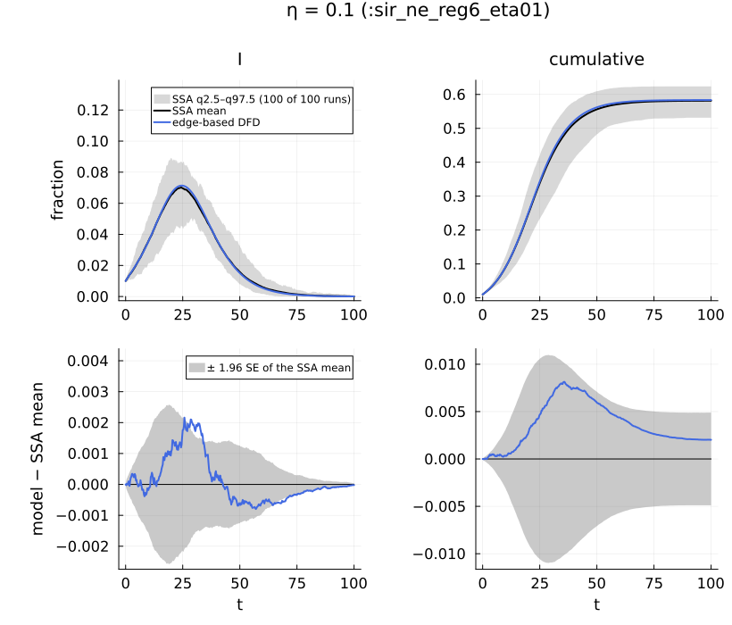
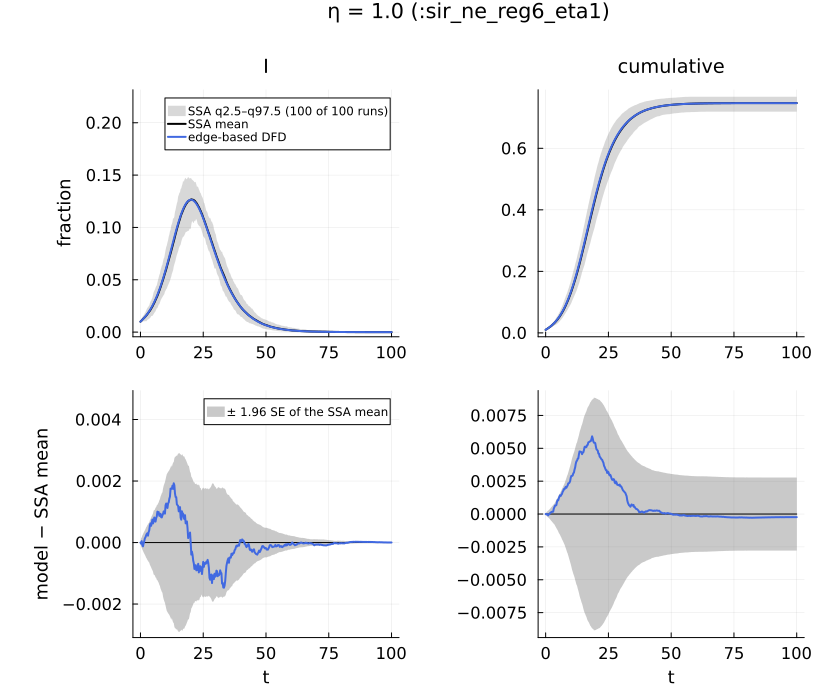
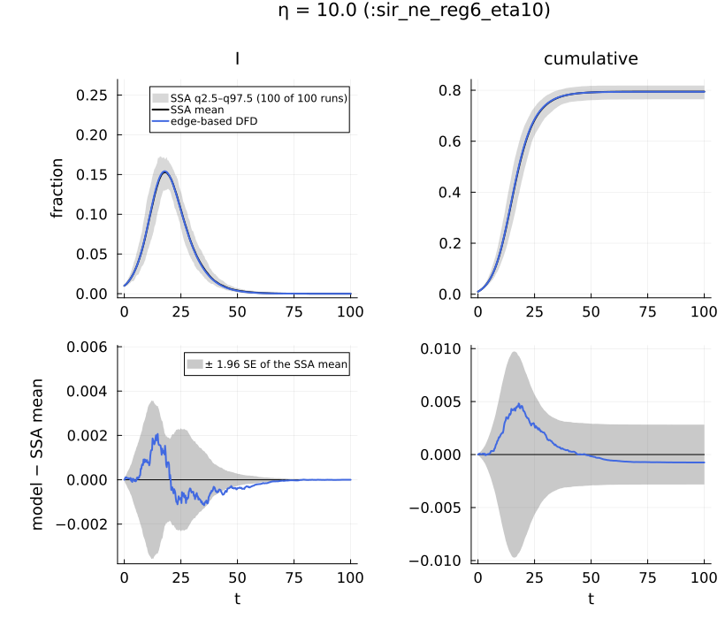
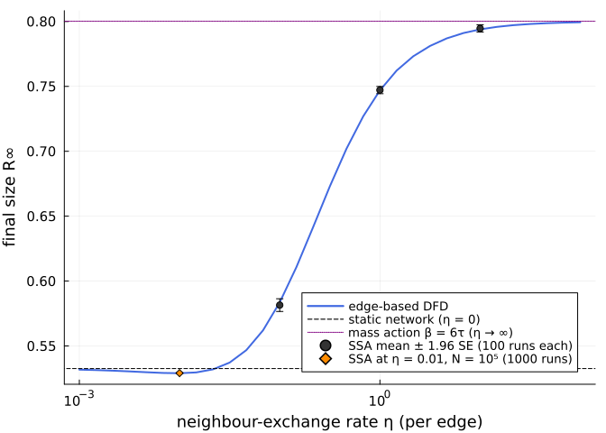

# Samplers and dynamic networks: neighbour exchange
Simon Frost

- [What this page shows](#what-this-page-shows)
- [Set-up](#set-up)
- [Part 1: cost per event](#part-1-cost-per-event)
- [Part 2: neighbour exchange](#part-2-neighbour-exchange)
  - [The process alone](#the-process-alone)
  - [The stochastic model, twice](#the-stochastic-model-twice)
  - [The edge-based DFD model, twice](#the-edge-based-dfd-model-twice)
  - [Against the committed ensembles](#against-the-committed-ensembles)
  - [From the static network to mass
    action](#from-the-static-network-to-mass-action)
  - [Below the static line at small
    η](#below-the-static-line-at-small-η)
- [Reproducibility](#reproducibility)

## What this page shows

1.  **The samplers.** NetworkOutbreaks has four exact samplers of the
    network Markov chain (`DirectSSA`, `NextReaction`,
    `CompositionRejection`, `HAS`). They differ in cost per event, which
    is measured here. That they sample the same distribution is tested
    statistically on the validation page (vignette 05), against
    committed ensembles.
2.  **Neighbour exchange.** A contact network whose edges swap partners
    at the per-edge rate η while the epidemic runs (the dynamic
    fixed-degree model of Miller, Slim & Volz, “DFD”),
    `DynamicNetwork(base, NeighbourExchange(η))`. It replaces the
    earlier demo of this page, in which 20% of the edges of a regular
    graph were rewired once at t = 10 in the endemic phase of an SIS
    epidemic: it changed nothing measurable and so demonstrated nothing.
    Here the process runs throughout, and the committed ensembles are
    compared with the edge-based DFD model at η = 0.1, 1 and 10, between
    the static limit (η = 0) and the mass-action limit (η → ∞).

## Set-up

``` julia
ENV["GKSwstype"] = "100"            # GR draws off-screen
using NetworkEpiCore, NetworkOutbreaks, Catalyst, Graphs, Plots, Printf, Statistics
using EdgeBasedModels
include(joinpath(@__DIR__, "..", "_shared", "scenarios.jl"))    # dfd_dip_scenario, DIP_ETA, VIGNETTE_DATA
include(joinpath(@__DIR__, "..", "_shared", "plotstyle.jl"))     # cmp_style, legend_room!, default font sizes

sir = @reaction_network sir begin
    @parameters τ γ
    τ, S + I --> 2I        # contact: per-contact (per-edge) rate τ
    γ, I --> R             # recovery
end
model = contact_model(sir)
@assert isequivalent(model, sir_model())
model
```

    ContactModel :sir  (source: Catalyst.ReactionSystem; method: stoichiometry; rates: PerContact)
      species       S (Sus)   I   R
      contacts      [1] S + I → I + I    τ    contact     infector I, entry I
      transitions   [2] I → R            γ    progress
      typing        T_EB  ⇒  edge_based ✓  s_anchored ✓  pairwise ✓  individual ✓  pair ✓  stochastic ✓  mass_action ✓
      assumptions   Sus inferred as recipients \ contact products = {S}

## Part 1: cost per event

One run of `:sir_pois5` (Poisson(5), τ = 1/6, γ = 1/4, 1% seeds) on a
fixed graph per size N, with each sampler. `keep = :counts` stores every
event time, so the number of events is known. Each timing is the minimum
of three runs (the first call compiles and is discarded).

``` julia
sc0 = scenario(:sir_pois5)
om  = OutbreakModel(model, sc0.params; network = sc0.network)
samplers = [DirectSSA(), NextReaction(), CompositionRejection(), HAS()]
function cost(alg, g; seed = 1)
    spec = OutbreakSpec(om, g, sc0.initial, sc0.tspan)
    simulate(spec; algorithm = alg, seed, keep = :counts)                      # compile
    t = minimum(@elapsed(simulate(spec; algorithm = alg, seed, keep = :counts)) for _ in 1:3)
    ev = length(simulate(spec; algorithm = alg, seed, keep = :counts).times) - 1
    return t, ev
end
rows = []
for N in (1_000, 10_000, 100_000)
    g, _ = sample_graph(sc0.network, N; rng = NetworkOutbreaks.stable_rng(N))
    for alg in samplers
        (alg isa DirectSSA && N > 10_000) && continue       # O(N) per event: too slow at 10⁵
        t, ev = cost(alg, g)
        push!(rows, (N, nameof(typeof(alg)), ev, t, 1e6 * t / ev))
    end
end
@printf("%-8s %-22s %9s %9s %12s\n", "N", "sampler", "events", "time (s)", "μs / event")
for r in rows
    @printf("%-8d %-22s %9d %9.4f %12.3f\n", r...)
end
```

    N        sampler                   events  time (s)   μs / event
    1000     DirectSSA                   1547    0.0426       27.551
    1000     NextReaction                1613    0.0008        0.472
    1000     CompositionRejection        1641    0.0008        0.480
    1000     HAS                         1639    0.0007        0.426
    10000    DirectSSA                  15895    5.7201      359.867
    10000    NextReaction               16021    0.0098        0.614
    10000    CompositionRejection       15553    0.0088        0.566
    10000    HAS                        16121    0.0101        0.628
    100000   NextReaction              159290    0.2390        1.500
    100000   CompositionRejection      159174    0.1829        1.149
    100000   HAS                       159205    0.2108        1.324

The per-event cost of `DirectSSA` grows in proportion to N (it sweeps
all rates), while that of the other three grows only slowly (logarithmic
data structures and memory effects). The ratios:

``` julia
per(N, name) = only(r[5] for r in rows if r[1] == N && r[2] === name)
@printf("DirectSSA: μs/event at N = 10⁴ over N = 10³: %.1f×\n", per(10_000, :DirectSSA) / per(1_000, :DirectSSA))
for name in (:NextReaction, :CompositionRejection, :HAS)
    @printf("%-21s μs/event at N = 10⁵ over N = 10³: %.2f×\n", name, per(100_000, name) / per(1_000, name))
end
```

    DirectSSA: μs/event at N = 10⁴ over N = 10³: 13.1×
    NextReaction          μs/event at N = 10⁵ over N = 10³: 3.18×
    CompositionRejection  μs/event at N = 10⁵ over N = 10³: 2.39×
    HAS                   μs/event at N = 10⁵ over N = 10³: 3.11×

Not every sampler runs every network: `DirectSSA` and
`CompositionRejection` refuse a graph process (Part 2), and
`CompositionRejection` also refuses interventions (both refusals are run
in `05_validation`).

## Part 2: neighbour exchange

### The process alone

`NeighbourExchangeProcess(η)` performs degree-preserving double-edge
swaps at total rate ηE/2, so each edge takes part in swaps at rate η; a
swap that would make a self-loop or a multiple edge is rejected. An edge
of the initial graph that has taken part in no accepted swap survives,
so the surviving fraction after time t is close to e^{−ηt} (an edge can
also be re-created by a later swap, with probability O(k/N)).

``` julia
η = 1.0
g0 = random_regular_graph(5000, 6; rng = NetworkOutbreaks.stable_rng(7))
E0 = Set(edges(g0))
g  = copy(g0)
elapsed = 0.0
total = 0
@printf("%6s %10s %10s %12s %10s\n", "t", "swaps", "accepted", "surviving", "e^{−ηt}")
for Δt in (0.25, 0.25, 0.5, 1.0)
    global elapsed += Δt
    c = evolve_graph!(g, NeighbourExchangeProcess(η), Δt; rng = NetworkOutbreaks.stable_rng(round(Int, 100elapsed)))
    surv = count(e -> e in E0, edges(g)) / length(E0)
    global total += c.events
    @printf("%6.2f %10d %10d %12.4f %10.4f\n", elapsed, c.events, c.rewired, surv, exp(-η * elapsed))
end
@printf("degrees after t = %.1f: %s (all 6: %s); edges %d → %d\n", elapsed, unique(degree(g)),
        all(==(6), degree(g)), ne(g0), ne(g))
@printf("total swaps %d; expected ηE/2 · t = %.0f, SD %.0f: z = %.1f\n", total, η * ne(g0) / 2 * elapsed,
        sqrt(η * ne(g0) / 2 * elapsed), (total - η * ne(g0) / 2 * elapsed) / sqrt(η * ne(g0) / 2 * elapsed))
```

         t      swaps   accepted    surviving    e^{−ηt}
      0.25       1938       1936       0.7709     0.7788
      0.50       1905       1900       0.5993     0.6065
      1.00       3751       3743       0.3642     0.3679
      2.00       7750       7726       0.1283     0.1353
    degrees after t = 2.0: [6] (all 6: true); edges 15000 → 15000
    total swaps 15344; expected ηE/2 · t = 15000, SD 122: z = 2.8

One path is one draw of a Poisson count, and this one lies high (the
z-score above). Over 200 independent replicates of t = 2 from the same
initial graph, the mean count and the mean surviving fraction are below.
Rejected swaps and edges re-created by a later swap make survival
slightly exceed e^{−ηt}; the rejections alone give e^{−ηt·a}, with a the
accepted fraction:

``` julia
reps = map(1:200) do s
    gs = copy(g0)
    c = evolve_graph!(gs, NeighbourExchangeProcess(η), 2.0; rng = NetworkOutbreaks.stable_rng(10_000 + s))
    (c.events, c.rewired, count(e -> e in E0, edges(gs)) / length(E0))
end
ev, acc, sv = first.(reps), getindex.(reps, 2), last.(reps)
@printf("swaps per replicate: mean %.1f ± %.1f (1.96 SE), expected ηE/2 · t = %.1f; accepted %.4f of them\n",
        mean(ev), 1.96 * std(ev) / sqrt(length(ev)), η * ne(g0) / 2 * 2.0, sum(acc) / sum(ev))
@printf("surviving fraction: mean %.4f ± %.4f; e^{−ηt} = %.4f, e^{−ηt·a} = %.4f\n", mean(sv),
        1.96 * std(sv) / sqrt(length(sv)), exp(-2η), exp(-2η * sum(acc) / sum(ev)))
```

    swaps per replicate: mean 15007.6 ± 15.5 (1.96 SE), expected ηE/2 · t = 15000.0; accepted 0.9977 of them
    surviving fraction: mean 0.1368 ± 0.0004; e^{−ηt} = 0.1353, e^{−ηt·a} = 0.1360

### The stochastic model, twice

The low level attaches the process to a graph with `DynamicGraph` and
runs an `OutbreakSpec`. The scenario route draws each run’s initial
graph from the base network and evolves it inside the sampler. Run r of
the committed ensemble is exactly the low-level run on its initial graph
with seed b + 2³² + r (design §J.7):

``` julia
sc = scenario(:sir_ne_reg6_eta1)
r  = 3
g_r = scenario_graph(sc, r)                                   # the graph run r starts from
dg  = DynamicGraph(g_r, NeighbourExchangeProcess(sc.network.process.η))
omd = OutbreakModel(model, sc.params; network = dg)
low = simulate(OutbreakSpec(omd, dg, sc.initial, sc.tspan); algorithm = NextReaction(),
               seed = sc.sim.base_seed + UInt64(2)^32 + r, keep = :counts)
high = scenario_run(sc, r; keep = :counts)
@assert low.counts == high.counts && low.times == high.times
@printf("run %d: %d events, identical trajectories: %s; final size %.4f\n", r, length(low.times) - 1,
        low.counts == high.counts, final_size(low))
```

    run 3: 7419 events, identical trajectories: true; final size 0.7468

The samplers that do not run graph processes refuse a dynamic graph
instead of silently simulating its initial, static graph:

``` julia
try
    simulate(OutbreakSpec(omd, dg, sc.initial, sc.tspan); algorithm = DirectSSA(), seed = 1)
catch err
    println(sprint(showerror, err))
end
```

    ArgumentError: a DynamicGraph (the graph process NeighbourExchangeProcess) runs only under NextReaction or HAS; DirectSSA and CompositionRejection do not simulate graph processes

### The edge-based DFD model, twice

`edge_based` lifts the contact model on the dynamic network. The
per-reaction table shows the lifted terms; the last row is the
neighbour-exchange process, which adds η(θπ_X − φ_X) to every φ_X (new
partners are drawn in proportion to stubs) and relaxes the partnership
memory χ.

``` julia
lift_contributions(model, sc.network)
```

    LiftContributions :sir on NetworkEpiCore.DynamicNetwork(NetworkEpiCore.ConfigurationNetwork(NetworkEpiCore.RegularDegree(6)), NetworkEpiCore.NeighbourExchange(1.0))  (dynamic closure)
      coordinates  θ, ξ, χ, φ_I, φ_R, π_I, π_R, pop_I, pop_R
      seed factors q_S (initially susceptible fraction of S)
      [1] S + I → 2I  (τ)   contact
            θ'      += -φ_I*τ
            φ_I'    += -φ_I*τ
            φ_I'    += 5*q_S*χ*(θ^4)*φ_I*ξ*τ
            π_I'    += 6*q_S*(θ^5)*φ_I*ξ*τ
            pop_I'  += 6q_S*(θ^5)*φ_I*ξ*τ
      [2] I → R  (γ)   progress
            φ_I'    += -φ_I*γ
            φ_R'    += φ_I*γ
            π_I'    += -π_I*γ
            π_R'    += π_I*γ
            pop_I'  += -pop_I*γ
            pop_R'  += pop_I*γ
      [3] neighbour exchange  (1.0)   process
            χ'      += -χ + θ^2
            φ_I'    += -φ_I + π_I*θ
            φ_R'    += -φ_R + π_R*θ

The same system from the canned model, compared symbolically:

``` julia
sys  = edge_based(model, sc.network)
sysF = edge_based(sir_model(), DynamicNetwork(RegularDegree(6), NeighbourExchange(1.0)))
@assert vector_fields_equal(symbolic_ode(sys), symbolic_ode(sysF))
symbolic_ode(sys)
```

    SymbolicODE :edge_based_model_edge_based (8 states)
      dθ/dt = -φ_I(t)*τ
      dχ/dt = -χ(t) + θ(t)^2
      dφ_I/dt = -φ_I(t) + π_I(t)*θ(t) - φ_I(t)*γ - φ_I(t)*τ + (5//1)*q_S*χ(t)*(θ(t)^4)*φ_I(t)*τ
      dφ_R/dt = -φ_R(t) + π_R(t)*θ(t) + φ_I(t)*γ
      dπ_I/dt = -π_I(t)*γ + (6//1)*q_S*(θ(t)^5)*φ_I(t)*τ
      dπ_R/dt = π_I(t)*γ
      dpop_I/dt = -pop_I(t)*γ + 6q_S*(θ(t)^5)*φ_I(t)*τ
      dpop_R/dt = pop_I(t)*γ
      parameters  τ, γ, q_S
      domain      θ ∈ (0.05, 1.0)

### Against the committed ensembles

``` julia
ids = (:sir_ne_reg6_eta01, :sir_ne_reg6_eta1, :sir_ne_reg6_eta10)
results = Dict{Symbol,Any}()
for id in ids
    s = scenario(id)
    ref = scenario_summary(s)
    sy = edge_based(model, s.network)
    det = model_curves(sy, solve_epidemic(sy, s); t = s.tgrid, label = "edge-based DFD")
    results[id] = (sc = s, ref = ref, det = det, tab = compare(ref, det))
    @printf(":%-18s η = %4.1f  N = %d, %d runs, %s, P(major) = %.3f (CI %.3f–%.3f)\n", id,
            s.network.process.η, ref.N, ref.nsims, s.sim.condition, ref.p_major, ref.p_major_ci...)
end
```

    :sir_ne_reg6_eta01  η =  0.1  N = 5000, 100 runs, MajorOutbreak(0.05), P(major) = 1.000 (CI 0.963–1.000)
    :sir_ne_reg6_eta1   η =  1.0  N = 5000, 100 runs, MajorOutbreak(0.05), P(major) = 1.000 (CI 0.963–1.000)
    :sir_ne_reg6_eta10  η = 10.0  N = 5000, 100 runs, MajorOutbreak(0.05), P(major) = 1.000 (CI 0.963–1.000)

``` julia
x = results[ids[1]]; comparisonplot(x.ref, x.det; observables = [:I, :cumulative], plot_title = "η = $(x.sc.network.process.η) (:$(x.sc.id))", cmp_style(2; title = true)...) |> legend_room!
```



``` julia
x = results[ids[2]]; comparisonplot(x.ref, x.det; observables = [:I, :cumulative], plot_title = "η = $(x.sc.network.process.η) (:$(x.sc.id))", cmp_style(2; title = true)...) |> legend_room!
```



``` julia
x = results[ids[3]]; comparisonplot(x.ref, x.det; observables = [:I, :cumulative], plot_title = "η = $(x.sc.network.process.η) (:$(x.sc.id))", cmp_style(2; title = true)...) |> legend_room!
```



``` julia
@printf("%-18s %8s %9s %8s %10s %24s\n", "scenario", "η", "D∞(I)", "z∞(I)", "ΔR∞", "95% CI")
for id in ids
    x = results[id]; row = x.tab["edge-based DFD", :I]
    @printf("%-18s %8.1f %9.5f %8.2f %+10.5f   (%+.5f, %+.5f)\n", id, x.sc.network.process.η,
            row.D∞, row.z∞, row.ΔR∞, row.ΔR∞_ci...)
end
```

    scenario                  η     D∞(I)    z∞(I)        ΔR∞                   95% CI
    sir_ne_reg6_eta01       0.1   0.00216     2.62   +0.00202   (-0.00287, +0.00691)
    sir_ne_reg6_eta1        1.0   0.00193     1.64   -0.00024   (-0.00302, +0.00254)
    sir_ne_reg6_eta10      10.0   0.00207     3.82   -0.00075   (-0.00357, +0.00208)

These pairs are declared `:exact_limit` (design §E.2 asks D∞(I) \< 0.005
and \|ΔR∞\| \< 0.005):

``` julia
for id in ids
    row = results[id].tab["edge-based DFD", :I]
    @printf(":%-18s D∞(I) < 0.005: %-5s |ΔR∞| < 0.005: %-5s 0 inside the ΔR∞ CI: %s\n", id,
            row.D∞ < 0.005, abs(row.ΔR∞) < 0.005, row.ΔR∞_ci[1] <= 0 <= row.ΔR∞_ci[2])
end
```

    :sir_ne_reg6_eta01  D∞(I) < 0.005: true  |ΔR∞| < 0.005: true  0 inside the ΔR∞ CI: true
    :sir_ne_reg6_eta1   D∞(I) < 0.005: true  |ΔR∞| < 0.005: true  0 inside the ΔR∞ CI: true
    :sir_ne_reg6_eta10  D∞(I) < 0.005: true  |ΔR∞| < 0.005: true  0 inside the ΔR∞ CI: true

### From the static network to mass action

Final size against η from the DFD model, with the three ensembles (mean
± 1.96 SE over the major runs) and the two limits: η = 0 is the static
configuration model; as η → ∞ on a 6-regular network every contact is
with a fresh uniformly chosen partner, which is mass action with β = 6τ
= 1/2, the same process as the well-mixed scenario `:sir_wm5` (κ = 5, τ
= 1/10).

``` julia
fs(net) = (sy = edge_based(model, net);
           model_curves(sy, solve_epidemic(sy; p = sc.params, initial = sc.initial, tspan = (0.0, 400.0),
                                          saveat = 0:1.0:400); t = 0:1.0:400)[:cumulative][end])
ηs = 10 .^ range(-3, 2; length = 31)
R_dfd = [fs(DynamicNetwork(RegularDegree(6), NeighbourExchange(e))) for e in ηs]
R_static = fs(ConfigurationNetwork(RegularDegree(6)))
R_ma = fs(WellMixed(6))
wm = scenario_summary(:sir_wm5)
wm_fs = wm.final_size[wm.major]
@printf("static (η = 0) R∞ = %.4f; mass action (η → ∞) R∞ = %.4f; :sir_wm5 SSA %.4f ± %.4f (N = %d, %d major of %d runs)\n",
        R_static, R_ma, mean(wm_fs), 1.96 * std(wm_fs) / sqrt(length(wm_fs)), wm.N, wm.n_major, wm.nsims)
plt = plot(ηs, R_dfd; xscale = :log10, lw = 2, color = :royalblue, label = "edge-based DFD",
           xlabel = "neighbour-exchange rate η (per edge)", ylabel = "final size R∞", legend = :bottomright)
hline!(plt, [R_static]; ls = :dash, color = :black, label = "static network (η = 0)")
hline!(plt, [R_ma]; ls = :dot, color = :purple, label = "mass action β = 6τ (η → ∞)")
for id in ids
    x = results[id]; f = x.ref.final_size[x.ref.major]
    scatter!(plt, [x.sc.network.process.η], [mean(f)]; yerror = [1.96 * std(f) / sqrt(length(f))],
             color = :gray20, label = id == first(ids) ? "SSA mean ± 1.96 SE (100 runs each)" : "")
end
dipd = scenario_summary(dfd_dip_scenario(:dynamic); dir = VIGNETTE_DATA)
f = dipd.final_size[dipd.major]
scatter!(plt, [DIP_ETA], [mean(f)]; yerror = [1.96 * std(f) / sqrt(length(f))], marker = :diamond,
         color = :darkorange, label = "SSA at η = 0.01, N = 10⁵ (1000 runs)")
# where the DFD curve crosses the static line upwards, bracketed on the 31-point grid
jx = findfirst(>=(R_static), R_dfd)
@printf("R∞(η) < R∞(0) at every grid η < %.4f (the first grid point, η = %.4f, gives R∞ − R∞(0) = %+.2e); ",
        ηs[jx], ηs[1], R_dfd[1] - R_static)
@printf("the curve crosses the static line between the grid points η = %.4f (%+.2e) and η = %.4f (%+.2e)\n",
        ηs[jx - 1], R_dfd[jx - 1] - R_static, ηs[jx], R_dfd[jx] - R_static)
plt
```

    static (η = 0) R∞ = 0.5326; mass action (η → ∞) R∞ = 0.8002; :sir_wm5 SSA 0.8001 ± 0.0012 (N = 10000, 200 major of 200 runs)
    R∞(η) < R∞(0) at every grid η < 0.0316 (the first grid point, η = 0.0010, gives R∞ − R∞(0) = -8.35e-04); the curve crosses the static line between the grid points η = 0.0215 (-6.29e-04) and η = 0.0316 (+4.62e-03)



### Below the static line at small η

The DFD curve does not rise monotonically from the static value: for 0
\< η ≲ 0.02–0.03 it lies *below* it. The table below shows R∞ − R∞(0) \<
0 from η = 10⁻⁶ upwards, and the output above the figure brackets the
upward crossing of the static line between the grid points η = 0.0215
and η = 0.0316 of the 31-point grid. The limit η → 0 is continuous
(R∞(η) − R∞(0) is linear in η, with a negative slope), and the
Miller–Slim–Volz DFD equations, written out by hand below and solved
without `edge_based`, give the same numbers:

``` julia
# The Miller–Slim–Volz DFD equations (Part II, §3.2.3) for ψ(x) = x⁶, written out by hand, with
# the 1% seeding of the scenario (S(0) = (1 − ρ)ψ(θ), π_S = (1 − ρ)θψ′(θ)/ψ′(1)).
function msv_dfd(η; β = sc.params[:τ], γ = sc.params[:γ], ρ = 0.01, T = 400.0)
    f(u, _, _) = begin
        θ, φS, φI, πR = u
        πS = (1 - ρ) * θ^6; πI = 1 - πS - πR
        [-β * φI,
         -β * φI * φS * 5 / θ + η * θ * πS - η * φS,
          β * φI * φS * 5 / θ + η * θ * πI - (β + γ + η) * φI,
          γ * πI]
    end
    u = [1.0, 1 - ρ, ρ, 0.0]; h = 0.01           # classical RK4, step 0.01
    for _ in 1:round(Int, T / h)
        k1 = f(u, 0, 0); k2 = f(u .+ h / 2 .* k1, 0, 0); k3 = f(u .+ h / 2 .* k2, 0, 0); k4 = f(u .+ h .* k3, 0, 0)
        u = u .+ h / 6 .* (k1 .+ 2k2 .+ 2k3 .+ k4)
    end
    return 1 - (1 - ρ) * u[1]^6
end
@printf("%8s %12s %14s %12s %14s\n", "η", "R∞ (lift)", "R∞ − R∞(0)", "R∞ (MSV)", "(R∞ − R∞(0))/η")
@printf("%8s %12.6f %14s %12.6f\n", "0", R_static, "", msv_dfd(0.0))
for e in (1e-6, 1e-4, 1e-3, 3e-3, 1e-2, 2e-2, 5e-2)
    R = fs(DynamicNetwork(RegularDegree(6), NeighbourExchange(e)))
    @printf("%8g %12.6f %+14.2e %12.6f %+14.3f\n", e, R, R - R_static, msv_dfd(e), (R - R_static) / e)
end
```

           η    R∞ (lift)     R∞ − R∞(0)     R∞ (MSV) (R∞ − R∞(0))/η
           0     0.532603                    0.532608
       1e-06     0.532602      -7.58e-07     0.532607         -0.758
      0.0001     0.532512      -9.03e-05     0.532518         -0.903
       0.001     0.531767      -8.35e-04     0.531772         -0.835
       0.003     0.530501      -2.10e-03     0.530505         -0.701
        0.01     0.528999      -3.60e-03     0.529002         -0.360
        0.02     0.531335      -1.27e-03     0.531337         -0.063
        0.05     0.549283      +1.67e-02     0.549285         +0.334

The dip is not an artefact of the ODEs. Two committed ensembles of the
vignette-local scenarios `:sir_ne_reg6_eta001_N1e5` (η = 0.01) and
`:sir_reg6_tau12_N1e5` (the same network without exchange), each N = 10⁵
with 1000 runs from the same base seed, resolve a difference of this
size (conditioning: major outbreak, final size \> 5%; alignment: none):

``` julia
dips = Dict(w => dfd_dip_scenario(w) for w in (:dynamic, :static))
diprefs = Dict(w => scenario_summary(dips[w]; dir = VIGNETTE_DATA) for w in keys(dips))
fsR(w) = (x = diprefs[w]; x.final_size[x.major])
for w in (:static, :dynamic)
    s, ref = dips[w], diprefs[w]
    sy = edge_based(model, s.network)
    row = compare(ref, model_curves(sy, solve_epidemic(sy, s); t = s.tgrid, label = "edge-based"))["edge-based", :I]
    @printf(":%-24s N = %d, %d runs, P(major) = %.3f: SSA R∞ = %.5f ± %.5f; ΔR∞ (ODE − SSA) = %+.5f (%+.5f, %+.5f), D∞(I) = %.4f\n",
            s.id, ref.N, ref.nsims, ref.p_major, mean(fsR(w)), 1.96 * std(fsR(w)) / sqrt(length(fsR(w))),
            row.ΔR∞, row.ΔR∞_ci..., row.D∞)
end
Δssa = mean(fsR(:dynamic)) - mean(fsR(:static))
Δse  = sqrt(var(fsR(:dynamic)) / length(fsR(:dynamic)) + var(fsR(:static)) / length(fsR(:static)))
Δode = fs(DynamicNetwork(RegularDegree(6), NeighbourExchange(DIP_ETA))) - R_static
@printf("R∞(η = 0.01) − R∞(static): SSA %+.5f ± %.5f (1.96 SE, z = %.1f); edge-based ODE %+.5f\n",
        Δssa, 1.96Δse, Δssa / Δse, Δode)
```

    :sir_reg6_tau12_N1e5      N = 100000, 1000 runs, P(major) = 1.000: SSA R∞ = 0.53255 ± 0.00047; ΔR∞ (ODE − SSA) = +0.00005 (-0.00042, +0.00052), D∞(I) = 0.0001
    :sir_ne_reg6_eta001_N1e5  N = 100000, 1000 runs, P(major) = 1.000: SSA R∞ = 0.52911 ± 0.00044; ΔR∞ (ODE − SSA) = -0.00011 (-0.00054, +0.00033), D∞(I) = 0.0001
    R∞(η = 0.01) − R∞(static): SSA -0.00345 ± 0.00064 (1.96 SE, z = -10.5); edge-based ODE -0.00360

Why exchange can lower the final size: on the locally tree-like static
network an infectious node’s partners other than its infector can only
be infected through it, so while it is infectious (and has not yet
transmitted to them) they are susceptible. A swap replaces one of its
partners by the owner of a uniformly chosen stub, which on a regular
network is susceptible with probability π_S = S(t). Swapping its
infector edge gains π_S susceptible partners; swapping one of its five
other edges changes the count by π_S − 1. Summed over the six edges, a
swap helps only while 6π_S − 5 \> 0, that is while S(t) \> 5/6. Exchange
also gives a susceptible node stuck next to a recovered one a fresh
partner, but that partner is infectious only with probability π_I, which
is small here. For `:sir_ne_reg6_eta1`, R₀ = 1.25 on the static network,
so the epidemic is slow and most of it happens after S has fallen below
5/6:

``` julia
sy0 = edge_based(model, ConfigurationNetwork(RegularDegree(6)))
cur = model_curves(sy0, solve_epidemic(sy0; p = sc.params, initial = sc.initial, tspan = (0.0, 400.0),
                                       saveat = 0:0.1:400); t = 0:0.1:400)
S = 1 .- cur[:cumulative]
i = findfirst(<(5 / 6), S)
@printf("static network: S(t) falls below 5/6 at t = %.1f, when %.1f%% of the final size R∞ = %.4f has occurred\n",
        cur.t[i], 100 * cur[:cumulative][i] / R_static, R_static)
```

    static network: S(t) falls below 5/6 at t = 17.8, when 31.4% of the final size R∞ = 0.5326 has occurred

At larger η the fresh partners carry the infection faster than the local
depletion matters, and the curve rises towards the mass-action value.
This argument is a heuristic; the numbers above, the independent MSV
solution and the two ensembles are the evidence.

## Reproducibility

``` julia
for id in ids
    x = results[id]
    @printf(":%s hash %s, %s\n", id, first(scenario_hash(x.sc), 8), x.ref.provenance["generator"])
end
println("Julia ", VERSION, "; threads ", Threads.nthreads())
```

    :sir_ne_reg6_eta01 hash 02dc3320, NetworkOutbreaks.summarise(scenario_ensemble(sc))
    :sir_ne_reg6_eta1 hash c77453d7, NetworkOutbreaks.summarise(scenario_ensemble(sc))
    :sir_ne_reg6_eta10 hash e5a00167, NetworkOutbreaks.summarise(scenario_ensemble(sc))
    Julia 1.12.7; threads 1
