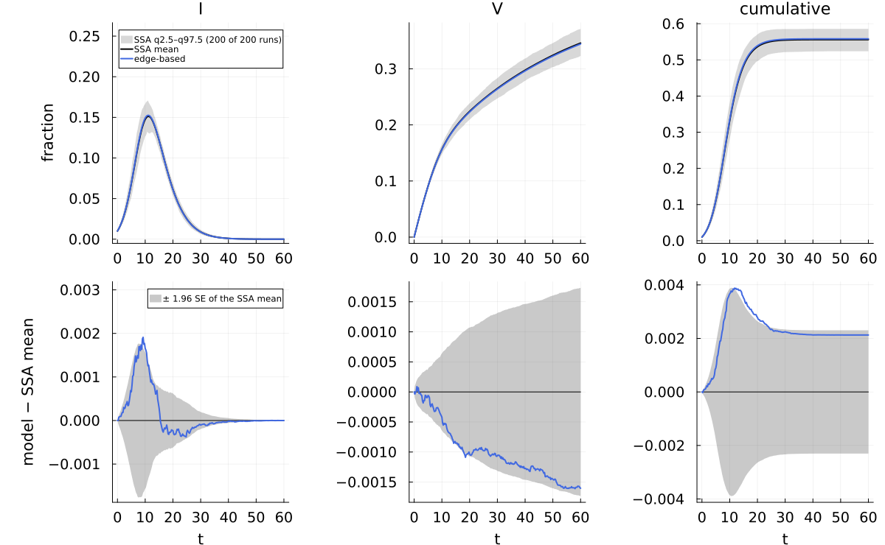
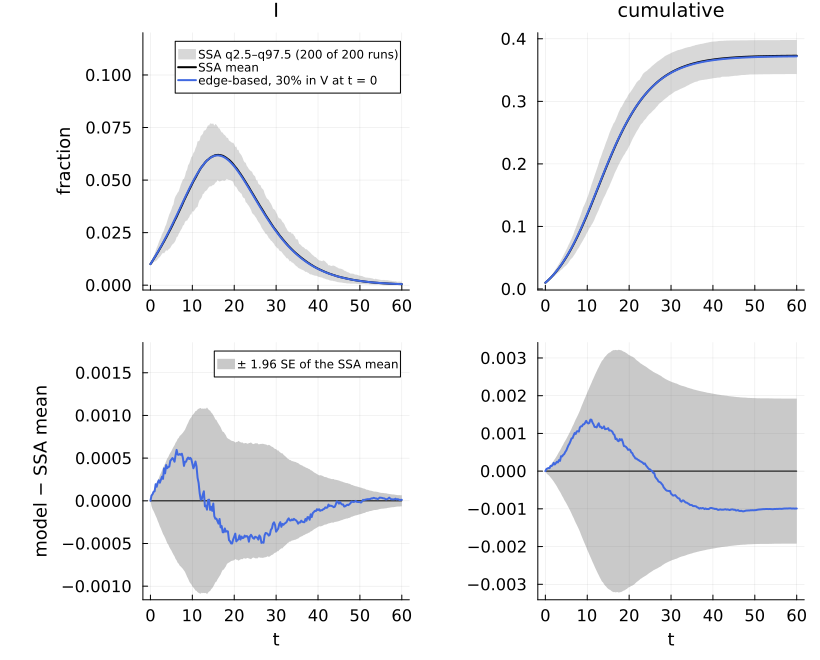
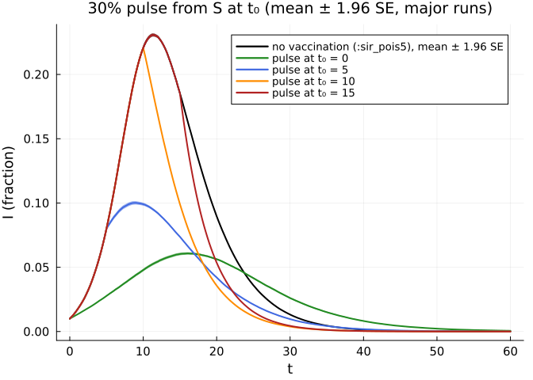

# Interventions: continuous vaccination and vaccination pulses
Simon Frost

- [What this page shows](#what-this-page-shows)
- [Set-up](#set-up)
- [1. Continuous vaccination](#1-continuous-vaccination)
- [2. A pulse at t = 0 is a seeding of
  V](#2-a-pulse-at-t--0-is-a-seeding-of-v)
- [3. Pulse timing, and the `from`
  filter](#3-pulse-timing-and-the-from-filter)
- [Reproducibility](#reproducibility)

## What this page shows

1.  **Continuous vaccination** S → V at rate ν is part of the model, so
    it has a committed reference ensemble (`:sir_vax_pois5`) and an
    exact-in-the-limit edge-based model (the survival factor ξ =
    e^{−νt}).
2.  **A vaccination pulse** — 30% of the population vaccinated at one
    time t₀ — is an *intervention* of the simulation,
    `ScheduledStateChange(t₀, :V, 0.3; from = [:S])`. A pulse at t₀ = 0
    is the same process as seeding 30% of the nodes in V, which is a
    scenario with a committed summary and an edge-based model; this
    checks the intervention machinery.
3.  **Pulse timing**, with and without the `from = [:S]` filter. Without
    it the pulse draws its doses from every compartment, so a late pulse
    spends many of them on infectious and recovered nodes. An earlier
    version of this page did that, which understated the effect of late
    pulses and so exaggerated the advantage of early vaccination.

Interventions are not part of a `Scenario` (their hash does not describe
them), so the pulse ensembles of parts 2 and 3 are simulated on this
page (with the scenario’s streams) and summarised with the same
`summarise` code as the committed ensembles.

## Set-up

``` julia
using NetworkEpiCore, NetworkOutbreaks, Catalyst, Plots, Printf, Statistics
using EdgeBasedModels
include(joinpath(@__DIR__, "..", "_shared", "scenarios.jl"))    # the vignette-local scenarios
include(joinpath(@__DIR__, "..", "_shared", "plotstyle.jl"))     # cmp_style, legend_room!, default font sizes

sirv = @reaction_network sirv begin
    @parameters τ γ ν
    τ, S + I --> 2I        # contact: per-contact rate τ
    γ, I --> R             # recovery
    ν, S --> V             # vaccination of susceptibles (an exit from the susceptible class)
end
model = contact_model(sirv)
```

    ContactModel :sirv  (source: Catalyst.ReactionSystem; method: stoichiometry; rates: PerContact)
      species       S (Sus)   I   R   V
      contacts      [1] S + I → I + I    τ    contact     infector I, entry I
      transitions   [2] I → R            γ    progress
                    [3] S → V            ν    exit
      typing        T_EB  ⇒  edge_based ✓  s_anchored ✓  pairwise ✓  individual ✓  pair ✓  stochastic ✓  mass_action ✓
      assumptions   Sus inferred as recipients \ contact products = {S}

``` julia
sc = scenario(:sir_vax_pois5)          # Poisson(5), τ = 1/6, γ = 1/4, ν = 0.02, 1% seeds in I, t ∈ [0, 60]
@assert isequivalent(model, sc.model)
@assert isequivalent(model, sirv_model())
ref = scenario_summary(sc)
@printf("N = %d, %d runs, %s: P(major) = %.3f (95%% CI %.3f–%.3f)\n", ref.N, ref.nsims, sc.sim.condition,
        ref.p_major, ref.p_major_ci...)
```

    N = 10000, 200 runs, MajorOutbreak(0.05): P(major) = 1.000 (95% CI 0.981–1.000)

## 1. Continuous vaccination

The edge-based model, from the Catalyst network and from the canned
`sirv_model()`:

``` julia
sys  = edge_based(model, sc.network)
sysF = edge_based(sirv_model(), ConfigurationNetwork(PoissonDegree(5)))
@assert vector_fields_equal(symbolic_ode(sys), symbolic_ode(sysF))
lift_contributions(model, sc.network)
```

    LiftContributions :sirv on NetworkEpiCore.ConfigurationNetwork(NetworkEpiCore.PoissonDegree(5.0))  (configuration closure)
      coordinates  θ, ξ, φ_I, φ_R, φ_V, pop_I, pop_R, pop_V
      seed factors q_S (initially susceptible fraction of S)
      [1] S + I → 2I  (τ)   contact
            θ'      += -φ_I*τ
            φ_I'    += -φ_I*τ
            φ_I'    += 5*q_S*exp(5.0(-1 + θ))*φ_I*ξ*τ
            pop_I'  += 5.0q_S*exp(5.0(-1 + θ))*φ_I*ξ*τ
      [2] I → R  (γ)   progress
            φ_I'    += -φ_I*γ
            φ_R'    += φ_I*γ
            pop_I'  += -pop_I*γ
            pop_R'  += pop_I*γ
      [3] S → V  (ν)   exit
            ξ'      += -ξ*ν
            φ_V'    += q_S*exp(5.0(-1 + θ))*ξ*ν
            pop_V'  += q_S*exp(5.0(-1 + θ))*ξ*ν

The exit adds −νξ to ξ̇ and moves stubs and nodes from S to V; S =
qξψ(θ).

``` julia
det = model_curves(sys, solve_epidemic(sys, sc); t = sc.tgrid, label = "edge-based")
comparisonplot(ref, det; observables = [:I, :V, :cumulative], cmp_style(3)...) |> legend_room!
```



``` julia
tab = compare(ref, det)
for X in (:I, :V)
    r = tab["edge-based", X]
    @printf("%-2s D∞ = %.5f (z∞ = %.2f)\n", X, r.D∞, r.z∞)
end
r = tab["edge-based", :I]
@printf("ΔR∞ = %+.5f, 95%% CI (%+.5f, %+.5f); declared %s\n", r.ΔR∞, r.ΔR∞_ci..., sc.backends[:edge_based])
```

    I  D∞ = 0.00191 (z∞ = 2.26)
    V  D∞ = 0.00161 (z∞ = 2.08)
    ΔR∞ = +0.00213, 95% CI (-0.00018, +0.00443); declared exact_limit

## 2. A pulse at t = 0 is a seeding of V

The seeded scenario (vignette-local, derived from `:sir_vax_pois5` with
ν = 0 and `SeedFraction(:I => 0.01, :V => 0.3)`) against the edge-based
model with the same seeds (q = 1 − 0.01 − 0.3):

``` julia
scp  = sirv_pulse0()
refp = scenario_summary(scp; dir = VIGNETTE_DATA)
@printf(":%s (hash %s): N = %d, %d runs, %s: P(major) = %.3f (CI %.3f–%.3f)\n", scp.id,
        first(scenario_hash(scp), 8), refp.N, refp.nsims, scp.sim.condition, refp.p_major, refp.p_major_ci...)
sysp = edge_based(model, scp.network)
detp = model_curves(sysp, solve_epidemic(sysp, scp); t = scp.tgrid, label = "edge-based, 30% in V at t = 0")
comparisonplot(refp, detp; observables = [:I, :cumulative], cmp_style(2)...) |> legend_room!
```

    :sirv_pulse0_pois5 (hash d11ad39a): N = 10000, 200 runs, MajorOutbreak(0.05): P(major) = 1.000 (CI 0.981–1.000)



``` julia
rp = compare(refp, detp)["edge-based, 30% in V at t = 0", :I]
@printf("D∞(I) = %.5f (z∞ = %.2f); ΔR∞ = %+.5f, 95%% CI (%+.5f, %+.5f)\n", rp.D∞, rp.z∞, rp.ΔR∞, rp.ΔR∞_ci...)
```

    D∞(I) = 0.00060 (z∞ = 1.95); ΔR∞ = -0.00099, 95% CI (-0.00291, +0.00093)

Now the intervention: the same model (ν = 0) seeded with 1% in I only,
and a pulse at t = 0 that moves 0.3·N = 3000 susceptible nodes, chosen
uniformly, to V. The runs use the scenario’s graphs and streams
(`seed = base_seed`), so the graphs are those of the committed ensemble.

``` julia
# the in-page scenario: `scp` without the V seeds (its runs are summarised; the pulse is not in its hash)
sc_int = derive(scp; id = :sirv_pulse_inpage, initial = SeedFraction(:I => 0.01))
function pulse_ensemble(t0; filtered = true, frac = PULSE_FRACTION)
    iv = filtered ? ScheduledStateChange(t0, :V, frac; from = [:S]) : ScheduledStateChange(t0, :V, frac)
    ens = simulate(sc_int.model, sc_int.network; N = sc_int.sim.N, p = sc_int.params, initial = sc_int.initial,
                   tspan = sc_int.tspan, nsims = sc_int.sim.nsims, seed = sc_int.sim.base_seed, keep = :events,
                   interventions = InterventionPlan([iv]), parallel = Threads.nthreads() > 1)
    return ens, summarise(scenario_ensemble(sc_int, ens.trajectories))
end
ens0, sum0 = pulse_ensemble(0.0)
fs_a = refp.final_size[refp.major]; fs_b = sum0.final_size[sum0.major]
se(x) = std(x) / sqrt(length(x))
z = (mean(fs_b) - mean(fs_a)) / sqrt(se(fs_a)^2 + se(fs_b)^2)
@printf("final size (major runs): seeded V %.5f ± %.5f, pulse at t = 0 %.5f ± %.5f (± 1.96 SE); z = %.2f\n",
        mean(fs_a), 1.96se(fs_a), mean(fs_b), 1.96se(fs_b), z)
dI = sum0.cond[:I].mean .- refp.cond[:I].mean
seI = sqrt.(sum0.cond[:I].se .^ 2 .+ refp.cond[:I].se .^ 2)
@printf("max_t |ΔI| between the two ensemble means = %.5f; max_t |ΔI|/SE = %.2f\n",
        maximum(abs.(dI)), maximum(abs.(dI) ./ max.(seI, 1e-4)))
```

    final size (major runs): seeded V 0.37292 ± 0.00192, pulse at t = 0 0.37207 ± 0.00194 (± 1.96 SE); z = -0.61
    max_t |ΔI| between the two ensemble means = 0.00134; max_t |ΔI|/SE = 2.30

The two are independent ensembles of the same process, so these
differences are Monte Carlo error: a \|z\| of the final sizes below
about 2 is expected, and the pointwise maximum over the 241 grid times
of the standardised difference of the means is naturally larger than a
single \|z\|.

## 3. Pulse timing, and the `from` filter

Pulses of 30% of the population at t₀ ∈ {0, 5, 10, 15}, with
`from = [:S]` (only susceptibles are vaccinated) and without it (every
compartment is eligible, as the earlier version of this page did). The
baseline is the committed `:sir_pois5` ensemble (the same network, rates
and seeds, without vaccination).

``` julia
base = scenario_summary(:sir_pois5)
fsb = base.final_size[base.major]
@printf("baseline :sir_pois5: final size %.4f ± %.4f (%d major of %d runs)\n", mean(fsb), 1.96se(fsb),
        base.n_major, base.nsims)
om = OutbreakModel(sc_int.model, sc_int.params; network = sc_int.network)
# nodes of compartment X moved into V by the pulse: the count just before t0 minus the count at t0 (the pulse is
# applied at t0; for t0 = 0 the first snapshot is the seeded state before it)
function moved(ens, t0, X)
    k = om.index_of[X]
    mean(begin
             jpre = t0 == 0 ? 1 : findlast(<(t0), traj.times)
             jpost = findlast(<=(t0), traj.times)
             traj.counts[k, jpre] - traj.counts[k, jpost]
         end for traj in ens.trajectories)
end
timing = []
for t0 in (0.0, 5.0, 10.0, 15.0), filtered in (true, false)
    ens, s = pulse_ensemble(t0; filtered)
    f = s.final_size[s.major]
    push!(timing, (t0 = t0, filtered = filtered, s = s, fs = mean(f), ci = 1.96se(f), movedI = moved(ens, t0, :I),
                   movedR = moved(ens, t0, :R), p = s.p_major))
end
@printf("%5s %-6s %11s %10s %13s %13s %9s\n", "t₀", "from", "final size", "± 1.96 SE", "I → V (mean)", "R → V (mean)",
        "P(major)")
for x in timing
    @printf("%5.1f %-6s %11.4f %10.4f %13.1f %13.1f %9.3f\n", x.t0, x.filtered ? "[:S]" : "all", x.fs, x.ci,
            x.movedI, x.movedR, x.p)
end
```

    baseline :sir_pois5: final size 0.8001 ± 0.0010 (200 major of 200 runs)
       t₀ from    final size  ± 1.96 SE  I → V (mean)  R → V (mean)  P(major)
      0.0 [:S]        0.3721     0.0019           0.0           0.0     1.000
      0.0 all         0.3702     0.0021          30.1           0.0     1.000
      5.0 [:S]        0.4175     0.0019           0.0           0.0     1.000
      5.0 all         0.4382     0.0022         240.1         135.5     1.000
     10.0 [:S]        0.5550     0.0023           0.0           0.0     1.000
     10.0 all         0.6153     0.0026         659.9         721.2     1.000
     15.0 [:S]        0.6992     0.0021           0.0           0.0     1.000
     15.0 all         0.7418     0.0017         556.0        1537.0     1.000

``` julia
plt = plot(base.t, base.cond[:I].mean; ribbon = 1.96 .* base.cond[:I].se, lw = 2, color = :black,
           label = "no vaccination (:sir_pois5), mean ± 1.96 SE", xlabel = "t", ylabel = "I (fraction)",
           title = "30% pulse from S at t₀ (mean ± 1.96 SE, major runs)")
for (x, c) in zip(filter(x -> x.filtered, timing), (:forestgreen, :royalblue, :darkorange, :firebrick))
    plot!(plt, x.s.t, x.s.cond[:I].mean; ribbon = 1.96 .* x.s.cond[:I].se, lw = 2, color = c,
          label = "pulse at t₀ = $(Int(x.t0))")
end
plt
```



The reduction of the final size by the pulse, relative to the baseline,
with and without the filter:

``` julia
for t0 in (0.0, 5.0, 10.0, 15.0)
    a = only(x for x in timing if x.t0 == t0 && x.filtered)
    b = only(x for x in timing if x.t0 == t0 && !x.filtered)
    @printf("t₀ = %4.1f: reduction %.4f (from = [:S]) vs %.4f (all compartments): the unfiltered pulse loses %.4f\n",
            t0, mean(fsb) - a.fs, mean(fsb) - b.fs, b.fs - a.fs)
end
```

    t₀ =  0.0: reduction 0.4280 (from = [:S]) vs 0.4299 (all compartments): the unfiltered pulse loses -0.0019
    t₀ =  5.0: reduction 0.3826 (from = [:S]) vs 0.3619 (all compartments): the unfiltered pulse loses 0.0207
    t₀ = 10.0: reduction 0.2451 (from = [:S]) vs 0.1848 (all compartments): the unfiltered pulse loses 0.0603
    t₀ = 15.0: reduction 0.1008 (from = [:S]) vs 0.0583 (all compartments): the unfiltered pulse loses 0.0425

At t₀ = 0 the two pulses differ only through the 1% seeds, and their
final sizes agree within the Monte Carlo error. Later, the unfiltered
pulse spends a growing share of its 3000 doses on infectious and
recovered nodes (the table above), so it vaccinates fewer susceptibles
and loses part of the effect.

## Reproducibility

``` julia
for s in (sc, scp, scenario(:sir_pois5))
    @printf(":%s hash %s\n", s.id, first(scenario_hash(s), 8))
end
println("in-page ensembles: ", sc_int.sim.nsims, " runs each, base seed ", sc_int.sim.base_seed,
        "; Julia ", VERSION, ", threads ", Threads.nthreads())
```

    :sir_vax_pois5 hash fb03c72c
    :sirv_pulse0_pois5 hash d11ad39a
    :sir_pois5 hash 34c89792
    in-page ensembles: 200 runs each, base seed 20260926; Julia 1.12.7, threads 1
