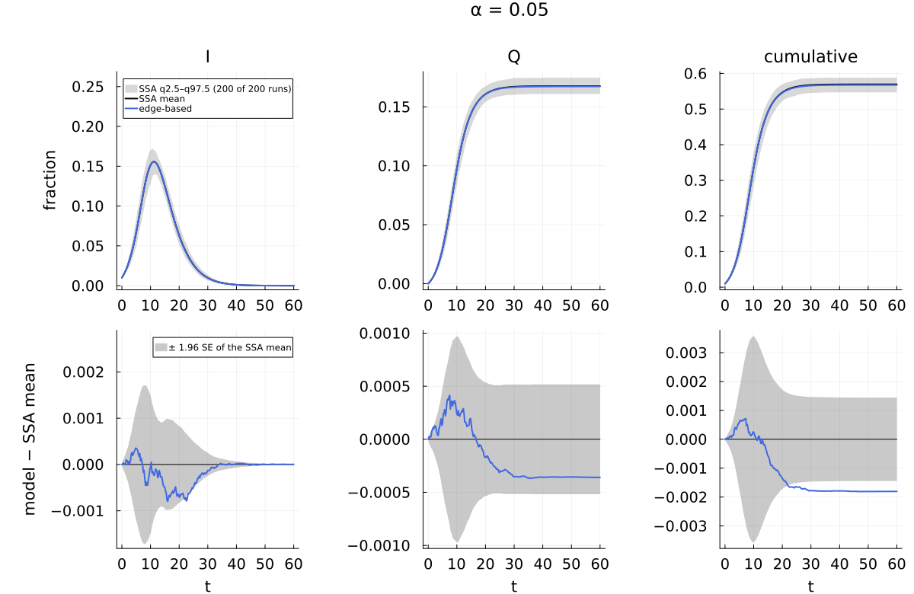
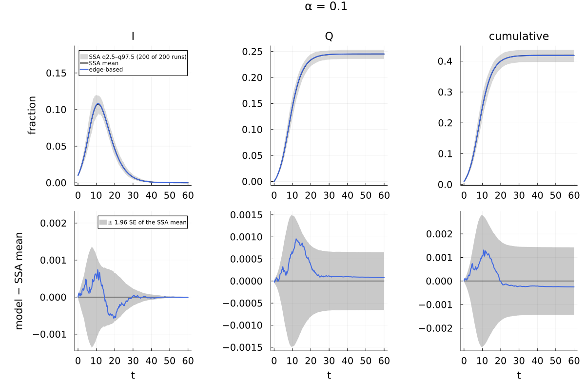
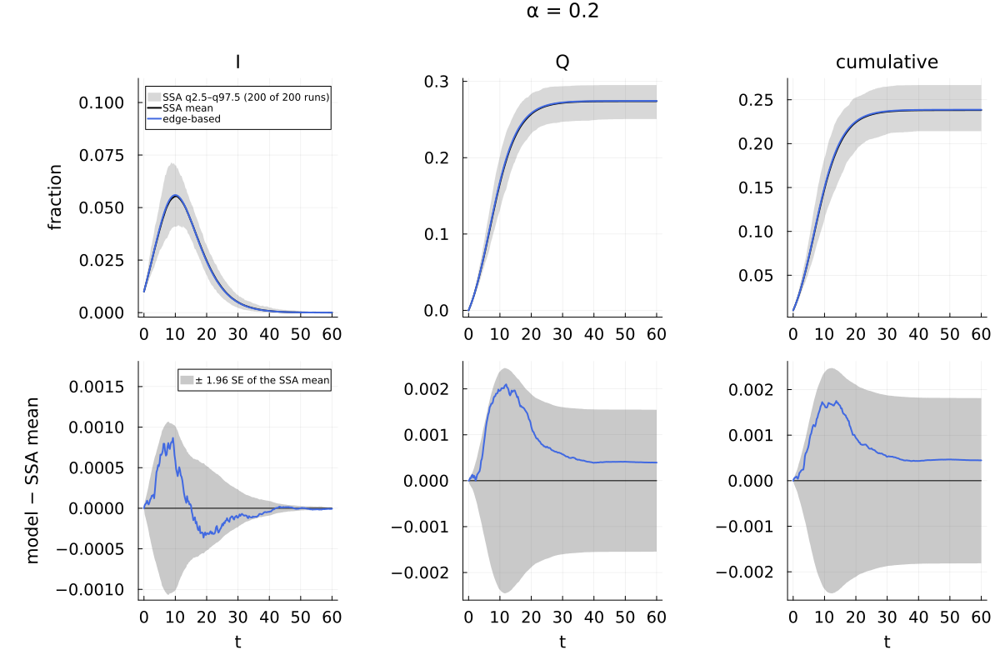
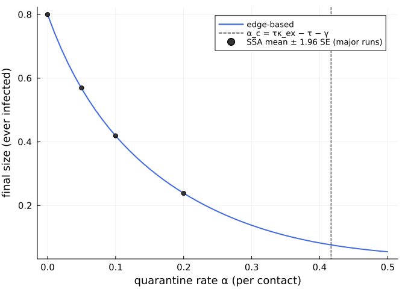

# Neighbour-triggered quarantine
Simon Frost

- [What this page shows](#what-this-page-shows)
- [Set-up and the model twice](#set-up-and-the-model-twice)
- [Against the committed ensembles](#against-the-committed-ensembles)
- [How much quarantine stops the
  epidemic?](#how-much-quarantine-stops-the-epidemic)
- [Reproducibility](#reproducibility)

## What this page shows

A susceptible node with an infectious neighbour is quarantined at the
per-contact rate α, as it is infected at the per-contact rate τ:

    S + I → 2I   (τ),     S + I → Q + I   (α),     I → R   (γ).

This is a *contact* whose product Q is not infected, so it is not an
infection: Q nodes do not count towards the final size. (It quarantines
exposed susceptibles; it does not trace and isolate infected nodes.)
Both contacts act across the same edge, so the model is edge-based
admissible: each edge from an infectious node fires at rate τ + α, and
the recipient becomes I with probability τ/(τ + α) and Q otherwise. The
edge-based model is therefore exact in the large-N limit, and this page
checks it against committed NetworkOutbreaks ensembles at α = 0.05, 0.1
and 0.2.

## Set-up and the model twice

``` julia
ENV["GKSwstype"] = "100"            # GR draws off-screen
using NetworkEpiCore, NetworkOutbreaks, Catalyst, Plots, Printf, Statistics
using EdgeBasedModels
include(joinpath(@__DIR__, "..", "_shared", "scenarios.jl"))   # SIRQ, sirq_scenario, VIGNETTE_DATA
include(joinpath(@__DIR__, "..", "_shared", "plotstyle.jl"))     # cmp_style, legend_room!, default font sizes

model = contact_model(SIRQ)            # the Catalyst network of _shared/scenarios.jl
```

    ContactModel :sirq  (source: Catalyst.ReactionSystem; method: stoichiometry; rates: PerContact)
      species       S (Sus)   I   Q   R
      contacts      [1] S + I → I + I    τ    contact     infector I, entry I
                    [2] S + I → Q + I    α    contact     infector I, entry Q
      transitions   [3] I → R            γ    progress
      typing        T_EB  ⇒  edge_based ✓  s_anchored ✓  pairwise ✓  individual ✓  pair ✓  stochastic ✓  mass_action ✓
      assumptions   Sus inferred as recipients \ contact products = {S}

The same model from the direct constructor:

``` julia
modelD = ContactModel(:sirq; contacts = [Contact(:S, :I, :I, :τ), Contact(:S, :I, :Q, :α)],
                      transitions = [NodeTransition(:I, :R, :γ)])
@assert isequivalent(model, modelD)
@show infected_species(model)          # Q is not infected (design §J.8)
@show entry_species(model);
```

    infected_species(model) = [:I]
    entry_species(model) = [:I, :Q]

In NetworkOutbreaks the quarantine contact becomes a neighbour-dependent
transition S → Q (listed with the neighbour-dependent type
`:infection`); Q is not in the infected set, so `final_size` does not
count it:

``` julia
sc1 = sirq_scenario(0.1)
OutbreakModel(model, sc1.params; network = sc1.network)
```

    OutbreakModel :sirq with 4 compartments and 3 transitions
      compartments: S, I*, Q, R   (* infectious)
      susceptible:  S
      infected:     I
      S → I  infection at 0.16666666666666666 via I
      S → Q  infection at 0.1 via I
      I → R  spontaneous at 0.25

The edge-based model from both, and its per-reaction terms: both
contacts deplete θ through φ_I, and each feeds its own product.

``` julia
sys  = edge_based(model, sc1.network)
sysD = edge_based(modelD, sc1.network)
@assert vector_fields_equal(symbolic_ode(sys), symbolic_ode(sysD))
lift_contributions(model, sc1.network)
```

    LiftContributions :sirq on NetworkEpiCore.ConfigurationNetwork(NetworkEpiCore.PoissonDegree(5.0))  (configuration closure)
      coordinates  θ, ξ, φ_I, φ_Q, φ_R, pop_I, pop_Q, pop_R
      seed factors q_S (initially susceptible fraction of S)
      [1] S + I → 2I  (τ)   contact
            θ'      += -φ_I*τ
            φ_I'    += -φ_I*τ
            φ_I'    += 5*q_S*exp(5.0(-1 + θ))*φ_I*ξ*τ
            pop_I'  += 5.0q_S*exp(5.0(-1 + θ))*φ_I*ξ*τ
      [2] S + I → Q + I  (α)   contact
            θ'      += -φ_I*α
            φ_I'    += -φ_I*α
            φ_Q'    += 5*q_S*exp(5.0(-1 + θ))*φ_I*ξ*α
            pop_Q'  += 5.0q_S*exp(5.0(-1 + θ))*φ_I*ξ*α
      [3] I → R  (γ)   progress
            φ_I'    += -φ_I*γ
            φ_R'    += φ_I*γ
            pop_I'  += -pop_I*γ
            pop_R'  += pop_I*γ

## Against the committed ensembles

``` julia
results = []
for α in TRACING_RATES
    sc  = sirq_scenario(α)
    ref = scenario_summary(sc; dir = VIGNETTE_DATA)
    det = model_curves(sys, solve_epidemic(sys, sc); t = sc.tgrid, label = "edge-based")
    push!(results, (α = α, sc = sc, ref = ref, det = det, tab = compare(ref, det)))
    @printf(":%s (hash %s): N = %d, %d runs, %s, P(major) = %.3f (CI %.3f–%.3f)\n", sc.id,
            first(scenario_hash(sc), 8), ref.N, ref.nsims, sc.sim.condition, ref.p_major, ref.p_major_ci...)
end
```

    :sirq_pois5_a005 (hash f14e598c): N = 10000, 200 runs, MajorOutbreak(0.05), P(major) = 1.000 (CI 0.981–1.000)
    :sirq_pois5_a01 (hash b32e81f4): N = 10000, 200 runs, MajorOutbreak(0.05), P(major) = 1.000 (CI 0.981–1.000)
    :sirq_pois5_a02 (hash 41d56afd): N = 10000, 200 runs, MajorOutbreak(0.05), P(major) = 1.000 (CI 0.981–1.000)

``` julia
x = results[1]; comparisonplot(x.ref, x.det; observables = [:I, :Q, :cumulative], plot_title = "α = $(x.α)", cmp_style(3; title = true)...) |> legend_room!
```



``` julia
x = results[2]; comparisonplot(x.ref, x.det; observables = [:I, :Q, :cumulative], plot_title = "α = $(x.α)", cmp_style(3; title = true)...) |> legend_room!
```



``` julia
x = results[3]; comparisonplot(x.ref, x.det; observables = [:I, :Q, :cumulative], plot_title = "α = $(x.α)", cmp_style(3; title = true)...) |> legend_room!
```



``` julia
@printf("%6s %9s %8s %9s %8s %10s %24s\n", "α", "D∞(I)", "z∞(I)", "D∞(Q)", "z∞(Q)", "ΔR∞", "95% CI")
for x in results
    a = x.tab["edge-based", :I]; b = x.tab["edge-based", :Q]
    @printf("%6.2f %9.5f %8.2f %9.5f %8.2f %+10.5f   (%+.5f, %+.5f)\n", x.α, a.D∞, a.z∞, b.D∞, b.z∞,
            a.ΔR∞, a.ΔR∞_ci...)
end
```

         α     D∞(I)    z∞(I)     D∞(Q)    z∞(Q)        ΔR∞                   95% CI
      0.05   0.00080     2.30   0.00041     1.40   -0.00180   (-0.00325, -0.00036)
      0.10   0.00074     1.68   0.00096     1.57   -0.00025   (-0.00168, +0.00118)
      0.20   0.00087     1.64   0.00210     1.78   +0.00045   (-0.00137, +0.00226)

All three pairs meet the §E.2 criteria for `:exact_limit` (D∞(I) \<
0.005, \|ΔR∞\| \< 0.005); at α = 0.05 the ΔR∞ interval just excludes 0,
a difference of about 2·10⁻³ in the final size.

## How much quarantine stops the epidemic?

With a single entry state the edge-based R₀ is κ_ex·T, where T = τ/(τ +
α + γ) is the probability that an edge from an infectious node transmits
before it quarantines the recipient or recovers. On Poisson(5) (κ_ex =
5) R₀ = 1 at α_c = τκ_ex − τ − γ:

``` julia
τ, γ = sc1.params[:τ], sc1.params[:γ]
κex = excess_degree(sc1.network)
αc = τ * κex - τ - γ
@printf("κ_ex = %.3f; R₀(α = 0) = %.3f; α_c = %.4f (= 5/12 = %.4f)\n", κex, κex * τ / (τ + γ), αc, 5 / 12)
```

    κ_ex = 5.000; R₀(α = 0) = 2.000; α_c = 0.4167 (= 5/12 = 0.4167)

The final size against α from the edge-based model, with the three
ensembles and the committed baseline `:sir_pois5` (α = 0):

``` julia
fs(α) = (s = derive(sc1; id = :tmp, params = Dict(:α => α), tspan = (0.0, 300.0));
         model_curves(sys, solve_epidemic(sys, s); t = s.tgrid)[:cumulative][end])
αs = range(0, 0.5; length = 51)
R = [fs(α) for α in αs]
base = scenario_summary(:sir_pois5)
se(x) = std(x) / sqrt(length(x))
plt = plot(αs, R; lw = 2, color = :royalblue, label = "edge-based", xlabel = "quarantine rate α (per contact)",
           ylabel = "final size (ever infected)", legend = :topright)
vline!(plt, [αc]; ls = :dash, color = :black, label = "α_c = τκ_ex − τ − γ")
pts = [(0.0, base.final_size[base.major]); [(x.α, x.ref.final_size[x.ref.major]) for x in results]]
scatter!(plt, first.(pts), [mean(last(p)) for p in pts]; yerror = [1.96se(last(p)) for p in pts],
         color = :gray20, label = "SSA mean ± 1.96 SE (major runs)")
plt
```



``` julia
@printf("edge-based final size at α = 0.40: %.4f, at α = 0.45: %.4f (near and above α_c the 1%% seeds and their short chains dominate)\n",
        fs(0.40), fs(0.45))
```

    edge-based final size at α = 0.40: 0.0824, at α = 0.45: 0.0660 (near and above α_c the 1% seeds and their short chains dominate)

## Reproducibility

``` julia
for x in results
    @printf(":%s hash %s, %s\n", x.sc.id, first(scenario_hash(x.sc), 8), x.ref.provenance["generator"])
end
println("regenerate with vignettes/data/generate.jl; Julia ", VERSION)
```

    :sirq_pois5_a005 hash f14e598c, NetworkOutbreaks.summarise(scenario_ensemble(sc))
    :sirq_pois5_a01 hash b32e81f4, NetworkOutbreaks.summarise(scenario_ensemble(sc))
    :sirq_pois5_a02 hash 41d56afd, NetworkOutbreaks.summarise(scenario_ensemble(sc))
    regenerate with vignettes/data/generate.jl; Julia 1.12.7
