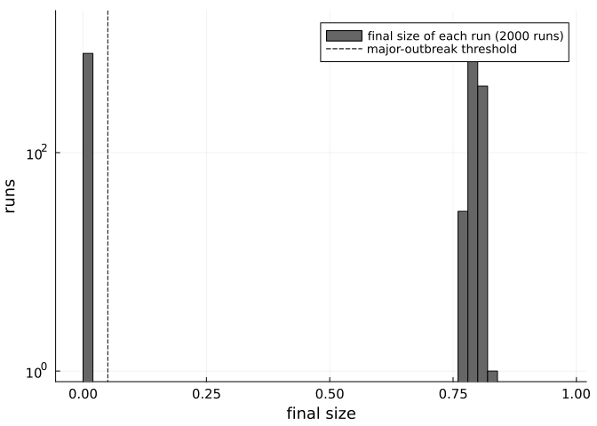
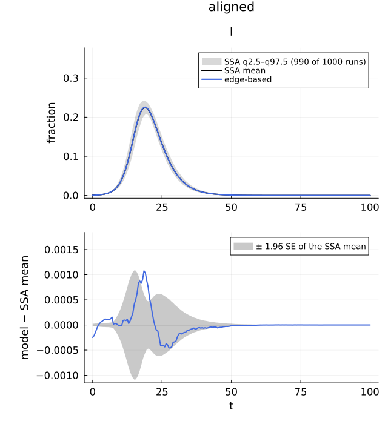
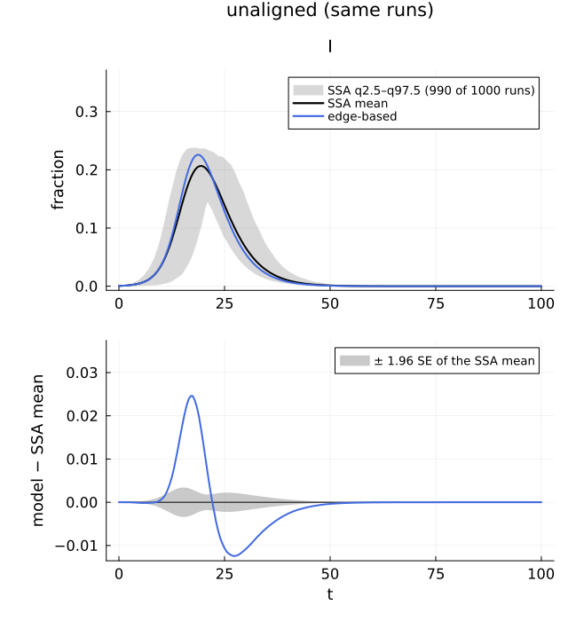
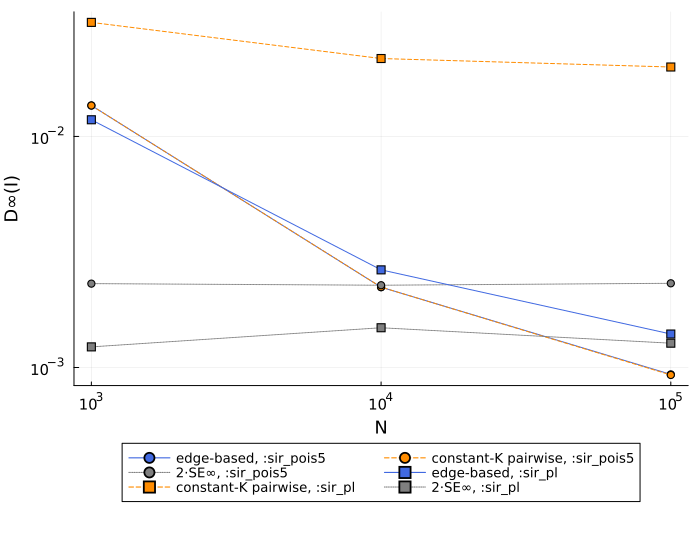

# The validation protocol: scenarios, conditioning, alignment, N-scaling and samplers
Simon Frost

- [What this page shows](#what-this-page-shows)
- [Set-up](#set-up)
- [1. The scenario protocol](#1-the-scenario-protocol)
- [2. Conditioning and P(major)](#2-conditioning-and-pmajor)
- [3. Time alignment](#3-time-alignment)
- [4. N-scaling](#4-n-scaling)
- [5. Sampler agreement: exact is not
  interchangeable](#5-sampler-agreement-exact-is-not-interchangeable)
- [Reproducibility](#reproducibility)

## What this page shows

How the reference ensembles that every EdgeBasedModels and
NodeBasedModels comparison uses are made, and how to read them:

1.  **the scenario protocol**: a scenario is pure data with a hash; its
    runs, graphs and summaries are reproducible one by one;
2.  **conditioning** on major outbreaks, and P(major) against the
    branching-process prediction;
3.  **time alignment** of small-seed runs, which have random delays;
4.  **N-scaling**: telling an approximation that is exact in the large-N
    limit from a structurally biased one;
5.  **sampler agreement**: the four exact samplers sample the same
    distribution, but they are not interchangeable run by run, nor in
    what they can simulate.

## Set-up

``` julia
using NetworkEpiCore, NetworkOutbreaks, Catalyst, Graphs, Plots, Printf, Statistics
using EdgeBasedModels
import NodeBasedModels as NBM
include(joinpath(@__DIR__, "..", "_shared", "scenarios.jl"))    # algorithm_scenario, VIGNETTE_DATA
include(joinpath(@__DIR__, "..", "_shared", "plotstyle.jl"))     # cmp_style, legend_room!, default font sizes

sir = @reaction_network sir begin
    @parameters τ γ
    τ, S + I --> 2I        # contact: per-contact (per-edge) rate τ
    γ, I --> R
end
model = contact_model(sir)
sc  = scenario(:sir_pois5)
@assert isequivalent(model, sc.model)
ref = scenario_summary(sc)
@printf("N = %d, %d runs, %s: P(major) = %.3f (CI %.3f–%.3f)\n", ref.N, ref.nsims, sc.sim.condition,
        ref.p_major, ref.p_major_ci...)
```

    N = 10000, 200 runs, MajorOutbreak(0.05): P(major) = 1.000 (CI 0.981–1.000)

The edge-based model used as the deterministic reference throughout,
from the Catalyst network and from the factory:

``` julia
sys  = edge_based(model, sc.network)
sysF = build_sir(PoissonDegree(5), :τ, :γ)
@assert vector_fields_equal(symbolic_ode(sys), symbolic_ode(sysF))
eb(s) = (y = edge_based(model, s.network); model_curves(y, solve_epidemic(y, s); t = s.tgrid, label = "edge-based"))
symbolic_ode(sys)
```

    SymbolicODE :edge_based_model_edge_based (5 states)
      dθ/dt = -φ_I(t)*τ
      dφ_I/dt = -φ_I(t)*γ - φ_I(t)*τ + (5//1)*q_S*exp(5.0(-1 + θ(t)))*φ_I(t)*τ
      dφ_R/dt = φ_I(t)*γ
      dpop_I/dt = -pop_I(t)*γ + 5.0q_S*exp(5.0(-1 + θ(t)))*φ_I(t)*τ
      dpop_R/dt = pop_I(t)*γ
      parameters  τ, γ, q_S
      domain      θ ∈ (0.05, 1.0)

## 1. The scenario protocol

A scenario fixes the model, network, parameters, seeding, time grid and
simulation settings. Its hash is the SHA-256 of a versioned canonical
text, not of Julia’s `hash` or `repr`:

``` julia
txt = canonical_text(sc)
println(txt)
@printf("hash %s; committed files %s.{toml,curves.csv,runs.csv}\n", scenario_hash(sc),
        summary_basename(sc.id, scenario_hash(sc)))
```

    scenario_format = 1
    initial = SeedFraction(fractions=[:I => 0.01], default=nothing)
    model = ContactModel(species=[:S, :I, :R], susceptible=[:S], convention=PerContact(), contacts=[Contact(recipient=:S, infector=:I, product=:I, rate=:τ, layer=:all)], transitions=[NodeTransition(from=:I, to=:R, rate=:γ)], labels=[])
    network = ConfigurationNetwork(degrees=PoissonDegree(mean=5))
    observables = [:S, :I, :R, :infectious, :cumulative]
    params = [:γ => 0.25, :τ => 0.16666666666666666]
    sim.N = 10000
    sim.algorithm = :next_reaction
    sim.align = NoAlignment()
    sim.base_seed = 20260926
    sim.condition = MajorOutbreak(threshold=0.050000000000000003)
    sim.graphs = :per_run
    sim.nsims = 200
    tgrid = StepRangeLen(start=0, step=0.25, length=241)
    tspan = (0, 60)

    hash 34c89792c3f7f8c0e0f9d4b2ce83aaafac299e4c50c06a7a435e42ec746a421f; committed files sir_pois5__34c89792.{toml,curves.csv,runs.csv}

Changing anything the simulation reads gives another scenario with
another hash, and `scenario_summary` never loads a summary of another
hash, algorithm revision or summary revision:

``` julia
sc199 = derive(sc; nsims = 199)
@printf("derived :%s, hash %s\n", sc199.id, first(scenario_hash(sc199), 8))
try
    scenario_summary(sc199)
catch err
    # print paths relative to the checkout, not the machine it was rendered on
    println(first(replace(sprint(showerror, err), dirname(pkgdir(NetworkOutbreaks)) * "/" => ""), 300), " …")
end
```

    derived :sir_pois5_nsims199, hash 084ac855
    ArgumentError: scenario_summary(:sir_pois5_nsims199): no valid committed summary (hash 084ac855, algorithm revision 2, summary revision 2) in NetworkOutbreaks.jl/data/scenarios: ArgumentError: load_summary: no summary sir_pois5_nsims199__084ac855 for scenario :sir_pois5_nsims199 in NetworkOutbreaks. …

Run r uses graph r, drawn from `stable_rng(b + r)`, and the SSA stream
`stable_rng(b + 2³² + r)` (b the base seed; design §J.7). So any run of
a committed ensemble can be regenerated alone:

``` julia
r = 17
traj = scenario_run(sc, r)
g = scenario_graph(sc, r)
@printf("run %d: final size %.4f regenerated, %.4f committed; mean degree %.4f regenerated, %.4f committed\n",
        r, final_size(traj), ref.final_size[r], 2ne(g) / nv(g), ref.realised[:mean_degree][r])
@assert round(final_size(traj); digits = 4) == round(ref.final_size[r]; digits = 4)
```

    run 17: final size 0.7992 regenerated, 0.7992 committed; mean degree 4.9862 regenerated, 4.9862 committed

## 2. Conditioning and P(major)

With ρN = 100 seeds every run of `:sir_pois5` is a major outbreak and
conditioning is a guard. From **one** seed (`:sir_pois5_1seed`, 2000
runs) most runs are either tiny or major: the final-size distribution is
bimodal, and `MajorOutbreak(0.05)` (at least 5% of N infected besides
the seeds) cuts it in the gap.

``` julia
s1 = scenario(:sir_pois5_1seed)
r1 = scenario_summary(s1)
c = r1.extras[:conditioning]
@printf("%d runs; %d major; largest minor run %.4f, smallest major run %.4f (new infections / N)\n",
        r1.nsims, r1.n_major, c["largest_unselected"], c["smallest_selected"])
y1 = edge_based(model, s1.network)
pm = epidemic_probability(y1; p = s1.params)
@printf("P(major) = %.4f, 95%% Wilson CI (%.4f, %.4f); infector-side branching process %.4f\n",
        r1.p_major, r1.p_major_ci..., pm)
@printf("mean final size: %.4f over the major runs, %.4f over all runs (edge-based R∞ %.4f)\n",
        mean(r1.final_size[r1.major]), mean(r1.final_size), eb(s1)[:cumulative][end])
histogram(r1.final_size; bins = 0:0.02:1, color = :gray40, label = "final size of each run (2000 runs)",
          xlabel = "final size", ylabel = "runs", yscale = :log10, ylims = (0.8, 2000))
vline!([0.05 + 1 / s1.sim.N]; color = :black, ls = :dash, label = "major-outbreak threshold")
```

    2000 runs; 1191 major; largest minor run 0.0027, smallest major run 0.7675 (new infections / N)
    P(major) = 0.5955, 95% Wilson CI (0.5738, 0.6168); infector-side branching process 0.6094
    mean final size: 0.7966 over the major runs, 0.4745 over all runs (edge-based R∞ 0.7968)



P(major) is the *infector-side* probability: all edges of an infectious
node share its infectious period, so their transmissions are correlated,
and the branching process accounts for that. The final size R∞ is the
recipient-side quantity; the two differ for an exponential infectious
period, as the printed numbers show, and the ensemble P(major) is to be
compared with the former.

## 3. Time alignment

Small-seed runs have random delays: two runs of the same process reach
2% cumulative incidence at different times. The unaligned mean is then a
smeared curve that no deterministic model follows. `:sir_pois5_5seeds`
(5 seeds, 1000 runs) aligns each run so that its cumulative incidence
excluding seeds crosses 2% at a common reference time; the unaligned
companion summary has the same runs. The deterministic curve is shifted
to cross 2% at the same time with `aligned_curves`.

``` julia
s5  = scenario(:sir_pois5_5seeds)
ra  = scenario_summary(s5)
ru  = scenario_summary(unaligned_scenario(s5))
d5  = eb(s5)
d5a = aligned_curves(d5, ra)
al  = ra.extras[:alignment]
@printf("%d runs, %d major (P = %.3f); reference time t* = %.2f; shift of the deterministic curve %.3f\n",
        ra.nsims, ra.n_major, ra.p_major, al["reference_time"], d5a.metadata[:alignment_shift])
sh = ra.shifts[ra.major]
@printf("shifts of the major runs: sd %.2f, 2.5–97.5%% range %.2f to %.2f\n", std(sh), quantile(sh, 0.025),
        quantile(sh, 0.975))
ta = compare(ra, d5a)["edge-based", :I]; tu = compare(ru, d5)["edge-based", :I]
@printf("D∞(I): aligned %.5f (z∞ %.1f), unaligned %.5f (z∞ %.1f)\n", ta.D∞, ta.z∞, tu.D∞, tu.z∞)
```

    1000 runs, 990 major (P = 0.990); reference time t* = 7.50; shift of the deterministic curve -0.137
    shifts of the major runs: sd 2.19, 2.5–97.5% range -2.31 to 5.80
    D∞(I): aligned 0.00108 (z∞ 3.7), unaligned 0.02458 (z∞ 17.5)

``` julia
comparisonplot(ra, d5a; observables = [:I], plot_title = "aligned", cmp_style(1; title = true)...) |> legend_room!
```



``` julia
comparisonplot(ru, d5; observables = [:I], plot_title = "unaligned (same runs)", cmp_style(1; title = true)...) |> legend_room!
```



## 4. N-scaling

At N nodes and n runs the Monte Carlo floor of D∞ is roughly 2·sd/√n,
while the finite-size bias of an exact-in-the-limit representation is
O(1/N). The N-scaling scenarios keep N·n constant (10³ × 2000, 10⁴ ×
200, 10⁵ × 20). An exact representation decays towards the floor; a
structurally biased one plateaus. Constant-K pairwise is exact on
Poisson networks (K = 1) and biased on the heavy-tailed `:sir_pl` (K =
⟨k(k−1)⟩/⟨k⟩² = 2.17).

``` julia
function scaling(base)
    rows = []
    for id in (Symbol(base, "_N1000"), base, Symbol(base, "_N100000"))
        s = scenario(id); rf = scenario_summary(s)
        pw = NBM.node_based(s)                               # constant-K pairwise (Bernoulli closure)
        dp = model_curves(pw, solve_epidemic(pw, s); t = s.tgrid, label = "pairwise")
        tab = compare(rf, eb(s), dp)
        push!(rows, (N = rf.N, n = rf.nsims, eb = tab["edge-based", :I], pw = tab["pairwise", :I]))
    end
    return rows
end
scal = Dict(b => scaling(b) for b in (:sir_pois5, :sir_pl))
@printf("%-10s %8s %6s %11s %11s %11s %11s %11s\n", "scenario", "N", "runs", "SE∞(I)", "D∞ EB", "D∞ PW",
        "ΔR∞ EB", "ΔR∞ PW")
for b in (:sir_pois5, :sir_pl), x in scal[b]
    @printf("%-10s %8d %6d %11.5f %11.5f %11.5f %+11.5f %+11.5f\n", b, x.N, x.n, x.eb.SE∞, x.eb.D∞, x.pw.D∞,
            x.eb.ΔR∞, x.pw.ΔR∞)
end
@printf("constant-K closure on :sir_pl: K = %.3f\n", closure_constant(scenario(:sir_pl).network.degrees))
```

    scenario          N   runs      SE∞(I)       D∞ EB       D∞ PW      ΔR∞ EB      ΔR∞ PW
    sir_pois5      1000   2000     0.00115     0.01361     0.01360    +0.00070    +0.00072
    sir_pois5     10000    200     0.00113     0.00223     0.00223    +0.00011    +0.00012
    sir_pois5    100000     20     0.00116     0.00093     0.00093    +0.00018    +0.00019
    sir_pl         1000   2000     0.00061     0.01180     0.03114    +0.01480    +0.08320
    sir_pl        10000    200     0.00074     0.00265     0.02173    +0.00173    +0.07013
    sir_pl       100000     20     0.00064     0.00140     0.01997    -0.00027    +0.06814
    constant-K closure on :sir_pl: K = 2.174

``` julia
# the legend goes below the axes, so that it covers none of the markers (the 2·SE∞ floor at N = 10³ included)
plt = plot(xscale = :log10, yscale = :log10, xlabel = "N", ylabel = "D∞(I)", legend = :outerbottom,
           legend_columns = 2, size = (700, 560), tickfontsize = 10, guidefontsize = 12, legendfontsize = 9)
for (b, m) in ((:sir_pois5, :circle), (:sir_pl, :square))
    xs = [x.N for x in scal[b]]
    plot!(plt, xs, [x.eb.D∞ for x in scal[b]]; marker = m, color = :royalblue, label = "edge-based, :$b")
    plot!(plt, xs, [x.pw.D∞ for x in scal[b]]; marker = m, color = :darkorange, ls = :dash,
          label = "constant-K pairwise, :$b")
    plot!(plt, xs, [2x.eb.SE∞ for x in scal[b]]; marker = m, color = :gray50, ls = :dot, label = "2·SE∞, :$b")
end
plt
```



## 5. Sampler agreement: exact is not interchangeable

`:sir_pois5_N1000` (N = 10³, 2000 runs) was committed with
`NextReaction`. The same scenario with `DirectSSA`,
`CompositionRejection` and `HAS` (vignette-local summaries, each its own
hash) must give the same distribution:

``` julia
rnr = scenario_summary(:sir_pois5_N1000)
se(x) = std(x) / sqrt(length(x))
fnr = rnr.final_size[rnr.major]
@printf("%-24s %8s %9s %10s %7s %14s %12s\n", "sampler", "hash", "P(major)", "final size", "z", "max|ΔI|/SE", "run 1 R∞")
@printf("%-24s %8s %9.4f %10.5f %7s %14s %12.4f\n", "next_reaction (committed)", first(scenario_hash(scenario(:sir_pois5_N1000)), 8),
        rnr.p_major, mean(fnr), "–", "–", rnr.final_size[1])
for alg in ALGORITHM_VARIANTS
    s = algorithm_scenario(alg); ra_ = scenario_summary(s; dir = VIGNETTE_DATA)
    f = ra_.final_size[ra_.major]
    z = (mean(f) - mean(fnr)) / sqrt(se(f)^2 + se(fnr)^2)
    dI = abs.(ra_.cond[:I].mean .- rnr.cond[:I].mean) ./ max.(sqrt.(ra_.cond[:I].se .^ 2 .+ rnr.cond[:I].se .^ 2), 1e-4)
    @printf("%-24s %8s %9.4f %10.5f %+7.2f %14.2f %12.4f\n", alg, first(scenario_hash(s), 8), ra_.p_major,
            mean(f), z, maximum(dI), ra_.final_size[1])
end
```

    sampler                      hash  P(major) final size       z     max|ΔI|/SE     run 1 R∞
    next_reaction (committed) 6b2f75c6    0.9995    0.79949       –              –       0.7450
    direct                   3b9f54d4    1.0000    0.79972   +0.30           1.91       0.7850
    composition_rejection    0d72fd39    1.0000    0.80003   +0.69           2.04       0.8030
    has                      f2edf421    1.0000    0.80015   +0.85           1.23       0.7680

The mean final sizes agree within their Monte Carlo errors (\|z\| \< 2
in every row), and so do the mean prevalence curves: the largest
pointwise standardised difference over the 241 grid times stays below 3.
But run 1, with the same graph and the same seed, is a different run
under each sampler (last column): the samplers consume random numbers
differently. That is why the sampler is part of the scenario’s hash, and
why `ALGORITHM_REVISION` is part of the cache key.

They are not interchangeable in what they can simulate either:

``` julia
omd = OutbreakModel(model, sc.params; network = sc.network)
g0  = scenario_graph(sc, 1)
dg  = DynamicGraph(g0, NeighbourExchangeProcess(1.0))
plan = InterventionPlan([ScheduledStateChange(5.0, :R, 0.1; from = [:S])])
cases = [("neighbour-exchange graph", OutbreakSpec(omd, dg, sc.initial, sc.tspan), InterventionPlan()),
         ("scheduled intervention", OutbreakSpec(omd, g0, sc.initial, sc.tspan), plan)]
for (what, spec, ivs) in cases, alg in (DirectSSA(), NextReaction(), CompositionRejection(), HAS())
    ok = try
        simulate(spec; algorithm = alg, seed = 1, interventions = ivs); "runs"
    catch err
        err isa ArgumentError || rethrow(); "refused (ArgumentError)"
    end
    @printf("%-26s %-22s %s\n", what, nameof(typeof(alg)), ok)
end
```

    neighbour-exchange graph   DirectSSA              refused (ArgumentError)
    neighbour-exchange graph   NextReaction           runs
    neighbour-exchange graph   CompositionRejection   refused (ArgumentError)
    neighbour-exchange graph   HAS                    runs
    scheduled intervention     DirectSSA              runs
    scheduled intervention     NextReaction           runs
    scheduled intervention     CompositionRejection   refused (ArgumentError)
    scheduled intervention     HAS                    runs

## Reproducibility

``` julia
println("NetworkOutbreaks ALGORITHM_REVISION = ", NetworkOutbreaks.ALGORITHM_REVISION,
        ", SUMMARY_REVISION = ", NetworkOutbreaks.SUMMARY_REVISION)
println("committed summaries: ", relpath(scenario_data_dir(), dirname(pkgdir(NetworkOutbreaks))))
println("vignette-local summaries: ", relpath(VIGNETTE_DATA, dirname(pkgdir(NetworkOutbreaks))), " (", length(vignette_scenarios()), " scenarios)")
println("Julia ", VERSION)
```

    NetworkOutbreaks ALGORITHM_REVISION = 2, SUMMARY_REVISION = 2
    committed summaries: NetworkOutbreaks.jl/data/scenarios
    vignette-local summaries: NetworkOutbreaks.jl/vignettes/data (11 scenarios)
    Julia 1.12.7
