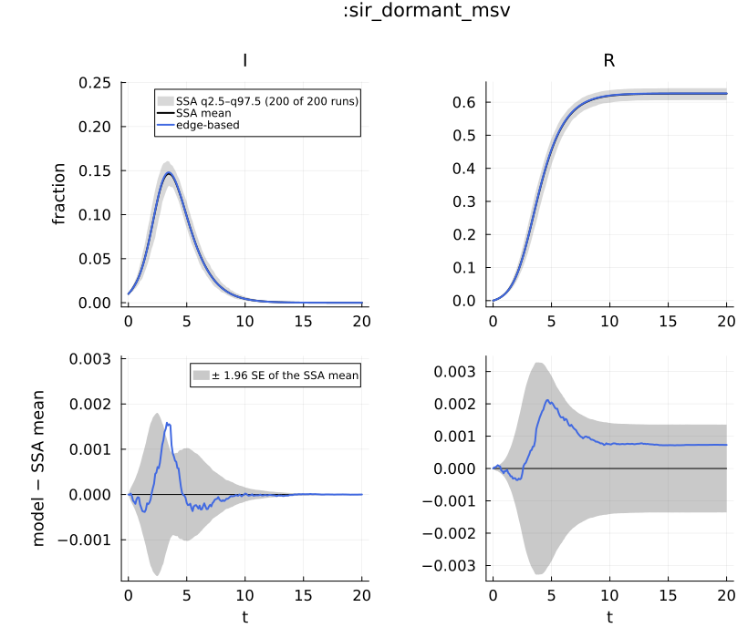
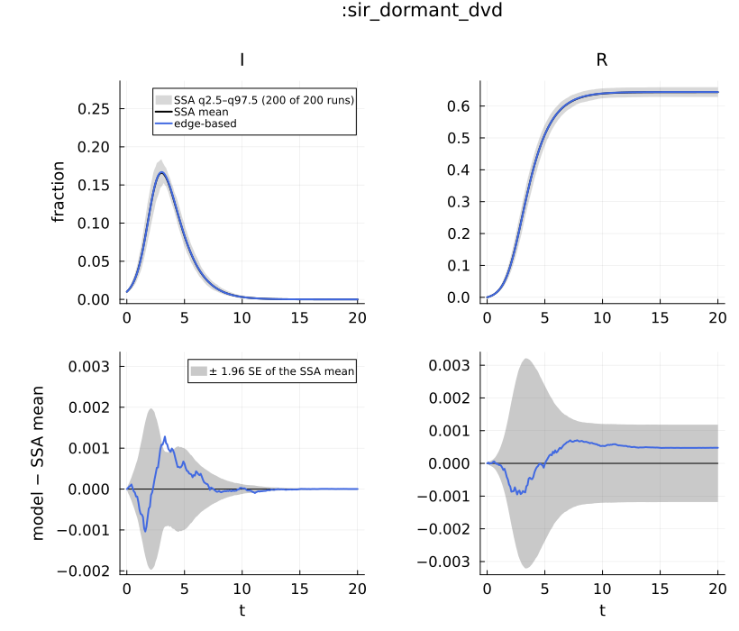
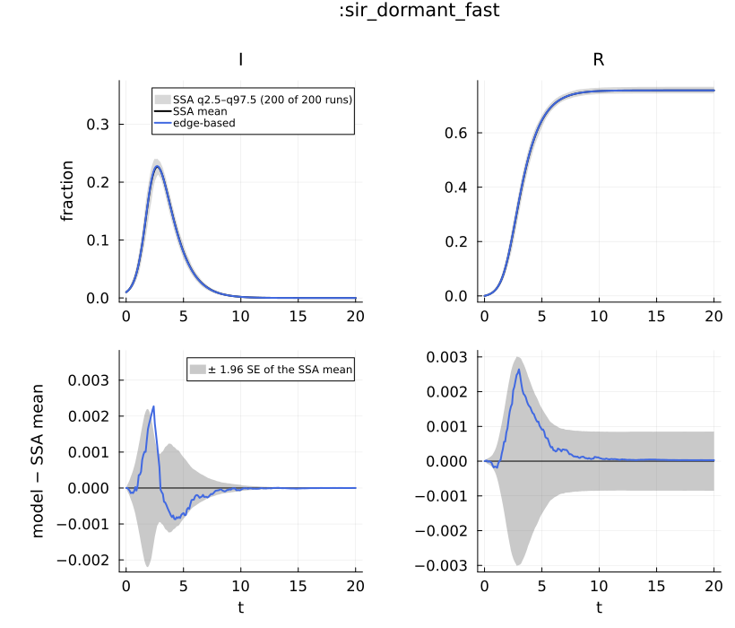
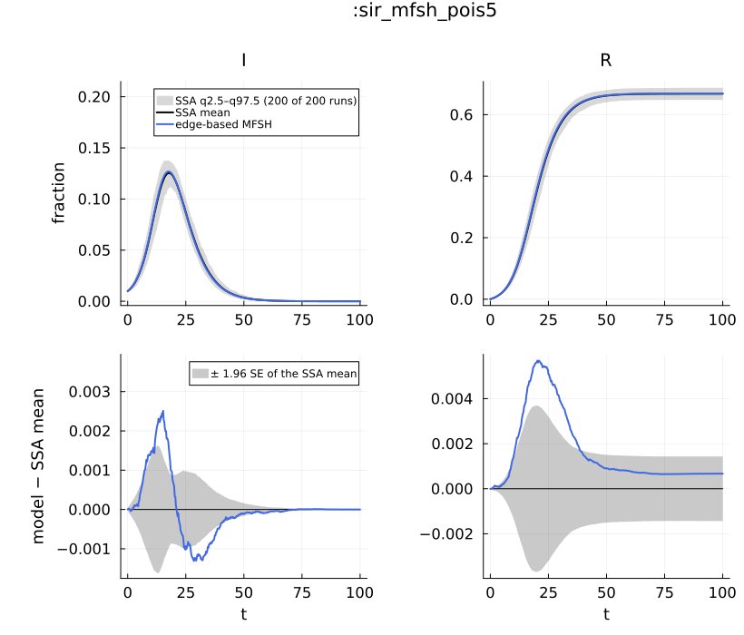
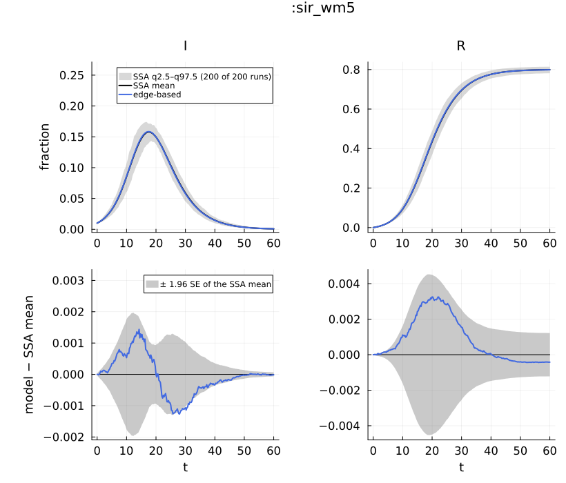
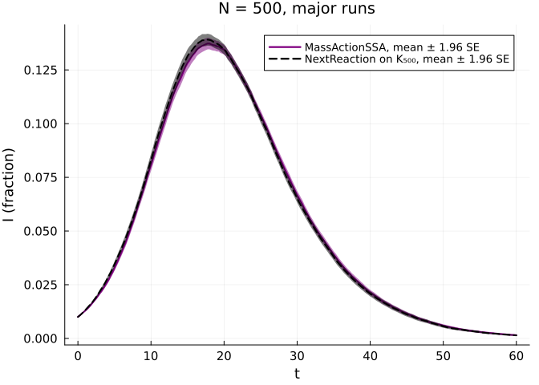

# Contact processes: dormant contacts, fleeting contacts and mass action
Simon Frost

- [What this page shows](#what-this-page-shows)
- [Set-up](#set-up)
- [1. Dormant contacts](#1-dormant-contacts)
  - [The process alone](#the-process-alone)
  - [The edge-based model](#the-edge-based-model)
  - [Against the committed ensembles](#against-the-committed-ensembles)
- [2. Fleeting contacts (MFSH)](#2-fleeting-contacts-mfsh)
- [3. Mass action: counts against the complete
  graph](#3-mass-action-counts-against-the-complete-graph)
- [Reproducibility](#reproducibility)

## What this page shows

Three contact structures beyond a static graph, each simulated exactly
by NetworkOutbreaks and compared with its edge-based model (Miller, Slim
& Volz 2012, Part II):

1.  **dormant contacts** — every node has k_m stubs; an active edge
    breaks at rate η_break and both stubs go dormant; a dormant stub
    becomes active at rate η_form by pairing with another activating
    stub (`DynamicNetwork(base, DormantContacts(η_form, η_break))`,
    `DormantContactProcess`);
2.  **fleeting contacts** (mean-field social heterogeneity, MFSH) — node
    v has k_v stubs, and at every instant each is joined to a uniformly
    chosen stub of another node, so no partnership persists
    (`MFSHNetwork(d)`, `FleetingContactSSA`);
3.  **mass action** — a well-mixed population, sampled on counts
    (`WellMixed(κ)`, `MassActionSSA`), against the same process on the
    complete graph.

## Set-up

``` julia
ENV["GKSwstype"] = "100"            # GR draws off-screen
using NetworkEpiCore, NetworkOutbreaks, Catalyst, Graphs, Plots, Printf, Statistics
using EdgeBasedModels
include(joinpath(@__DIR__, "..", "_shared", "scenarios.jl"))    # wm_small, VIGNETTE_DATA
include(joinpath(@__DIR__, "..", "_shared", "plotstyle.jl"))     # cmp_style, legend_room!, default font sizes

sir = @reaction_network sir begin
    @parameters τ γ
    τ, S + I --> 2I        # contact: per-contact (per-stub) rate τ
    γ, I --> R
end
model = contact_model(sir)
@assert isequivalent(model, sir_model())

se(x) = std(x) / sqrt(length(x))
function against(id; dir = nothing, label = "edge-based")
    s = scenario(id)
    ref = dir === nothing ? scenario_summary(s) : scenario_summary(s; dir)
    y = edge_based(model, s.network)
    det = model_curves(y, solve_epidemic(y, s); t = s.tgrid, label)
    @printf(":%s (hash %s): N = %d, %d runs, sampler :%s, %s, P(major) = %.3f (CI %.3f–%.3f)\n", id,
            first(scenario_hash(s), 8), ref.N, ref.nsims, s.sim.algorithm, s.sim.condition, ref.p_major,
            ref.p_major_ci...)
    return (sc = s, ref = ref, sys = y, det = det, tab = compare(ref, det))
end
function report(x; label = "edge-based")
    for X in (:I, :R)
        r = x.tab[label, X]
        @printf("   %-2s D∞ = %.5f at t = %.2f (z∞ = %.2f)\n", X, r.D∞, r.t_D∞, r.z∞)
    end
    r = x.tab[label, :I]
    @printf("   ΔR∞ = %+.5f, 95%% CI (%+.5f, %+.5f); declared %s\n", r.ΔR∞, r.ΔR∞_ci..., x.sc.backends[:edge_based])
end
```

    report (generic function with 1 method)

## 1. Dormant contacts

### The process alone

At stationarity each stub is active with probability A =
η_form/(η_form + η_break), independently, which is how a run’s initial
state is drawn:

``` julia
s_msv = scenario(:sir_dormant_msv)
dgr, info = sample_graph(s_msv.network, 10_000; rng = NetworkOutbreaks.stable_rng(1))
@printf("%s\n", dgr.process)
@printf("active stub fraction %.4f (target A = %.4f); mean active degree %.4f; mean stub count %.4f\n",
        info.details.active_fraction, info.details.target_active_fraction, info.mean_degree,
        info.details.mean_max_degree)
g = copy(dgr.graph)
for Δt in (0.5, 2.0)
    c = evolve_graph!(g, dgr.process, Δt; rng = NetworkOutbreaks.stable_rng(round(Int, 10Δt)))
    @printf("after a further t = %.1f: %d events (%d broken, %d formed, %d rejected); active fraction %.4f\n",
            Δt, c.events, c.broken, c.formed, c.rejected, 2ne(g) / sum(dgr.process.max_degrees))
end
@printf("no node exceeds its stubs: %s\n", all(degree(g) .<= dgr.process.max_degrees))
```

    DormantContactProcess(η_form = 1.0, η_break = 1.0, 10000 nodes, 50132 stubs)
    active stub fraction 0.4980 (target A = 0.5000); mean active degree 2.4968; mean stub count 5.0132
    after a further t = 0.5: 12634 events (6301 broken, 6330 formed, 3 rejected); active fraction 0.4992
    after a further t = 2.0: 50338 events (25117 broken, 25215 formed, 6 rejected); active fraction 0.5031
    no node exceeds its stubs: true

### The edge-based model

Its coordinates condition on the activity of a stub (θ_A, θ_D), carry
the partnership memory χ, and split stubs of each state into active
(α_X) and dormant (π_X). The per-reaction table, whose last row holds
the stub-process terms:

``` julia
lift_contributions(model, s_msv.network)
```

    LiftContributions :sir on NetworkEpiCore.DynamicNetwork(NetworkEpiCore.ConfigurationNetwork(NetworkEpiCore.EmpiricalDegree([0.0, 0.0, 0.5, 0.0, 0.0, 0.0, 0.0, 0.0, 0.5])), NetworkEpiCore.DormantContacts(1.0, 1.0))  (dormant closure)
      coordinates  θ, θ_A, θ_D, χ, ξ, φ_I, φ_R, α_I, α_R, π_I, π_R, pop_I, pop_R
      seed factors q_S (initially susceptible fraction of S)
      [1] S + I → 2I  (τ)   contact
            θ'      += -0.5φ_I*τ
            θ_A'    += -φ_I*τ
            φ_I'    += -φ_I*τ
            φ_I'    += 0.1q_S*χ*(1 + 28.0(θ^6))*φ_I*ξ*τ
            α_I'    += (1/5)*q_S*(θ + 0.5θ_A*(1 + 28.0(θ^6)) + 4.0(θ^7))*φ_I*ξ*τ
            π_I'    += 0.1q_S*θ_D*(1 + 28.0(θ^6))*φ_I*ξ*τ
            pop_I'  += 0.5q_S*(θ + 4.0(θ^7))*φ_I*ξ*τ
      [2] I → R  (γ)   progress
            φ_I'    += -φ_I*γ
            φ_R'    += φ_I*γ
            α_I'    += -α_I*γ
            α_R'    += α_I*γ
            π_I'    += -π_I*γ
            π_R'    += π_I*γ
            pop_I'  += -pop_I*γ
            pop_R'  += pop_I*γ
      [3] dormant contacts  (η_form = 1.0, η_break = 1.0)   process
            θ_A'    += -θ_A + θ_D
            θ_D'    += θ_A - θ_D
            χ'      += -χ + θ_D^2
            φ_I'    += -φ_I + π_I*θ_D
            α_I'    += π_I - α_I
            π_I'    += -π_I + α_I
            φ_R'    += -φ_R + π_R*θ_D
            α_R'    += π_R - α_R
            π_R'    += -π_R + α_R

From the canned model, compared symbolically:

``` julia
@assert vector_fields_equal(symbolic_ode(edge_based(model, s_msv.network)),
                            symbolic_ode(edge_based(sir_model(), s_msv.network)))
println("the Catalyst and canned lifts have the same vector field")
```

    the Catalyst and canned lifts have the same vector field

### Against the committed ensembles

`:sir_dormant_msv` (η_form = η_break = 1, k_m ∈ {2, 8}),
`:sir_dormant_dvd` (η_form = 0.1, η_break = 1, k_m ∈ {11, 44}: the
dynamic variable-degree regime) and `:sir_dormant_fast` (η_form =
η_break = 10), all with τ = γ = 1:

``` julia
dormant = [against(id) for id in (:sir_dormant_msv, :sir_dormant_dvd, :sir_dormant_fast)]
for x in dormant
    println(":", x.sc.id); report(x)
end
```

    :sir_dormant_msv (hash 10d932b9): N = 10000, 200 runs, sampler :next_reaction, MajorOutbreak(0.05), P(major) = 1.000 (CI 0.981–1.000)
    :sir_dormant_dvd (hash c781d1f2): N = 10000, 200 runs, sampler :next_reaction, MajorOutbreak(0.05), P(major) = 1.000 (CI 0.981–1.000)
    :sir_dormant_fast (hash 9fabc2c3): N = 10000, 200 runs, sampler :next_reaction, MajorOutbreak(0.05), P(major) = 1.000 (CI 0.981–1.000)
    :sir_dormant_msv
       I  D∞ = 0.00159 at t = 3.30 (z∞ = 3.09)
       R  D∞ = 0.00212 at t = 4.70 (z∞ = 1.45)
       ΔR∞ = +0.00073, 95% CI (-0.00063, +0.00209); declared exact_limit
    :sir_dormant_dvd
       I  D∞ = 0.00128 at t = 3.30 (z∞ = 2.74)
       R  D∞ = 0.00095 at t = 2.60 (z∞ = 1.07)
       ΔR∞ = +0.00048, 95% CI (-0.00070, +0.00166); declared exact_limit
    :sir_dormant_fast
       I  D∞ = 0.00227 at t = 2.40 (z∞ = 2.86)
       R  D∞ = 0.00264 at t = 3.00 (z∞ = 1.73)
       ΔR∞ = +0.00003, 95% CI (-0.00082, +0.00088); declared exact_limit

``` julia
x = dormant[1]; comparisonplot(x.ref, x.det; observables = [:I, :R], plot_title = ":$(x.sc.id)", cmp_style(2; title = true)...) |> legend_room!
```



``` julia
x = dormant[2]; comparisonplot(x.ref, x.det; observables = [:I, :R], plot_title = ":$(x.sc.id)", cmp_style(2; title = true)...) |> legend_room!
```



``` julia
x = dormant[3]; comparisonplot(x.ref, x.det; observables = [:I, :R], plot_title = ":$(x.sc.id)", cmp_style(2; title = true)...) |> legend_room!
```



As η_form = η_break → ∞ the dormant-contact model tends to fleeting
contacts with the per-contact rate τA; `:sir_mfsh_msv` is that limit of
`:sir_dormant_fast` (τA = 1/2):

``` julia
fast = dormant[3]; mfsh_msv = against(:sir_mfsh_msv; label = "edge-based MFSH")
for (name, x) in (("dormant, η = 10", fast), ("MFSH, τ = 1/2", mfsh_msv))
    f = x.ref.final_size[x.ref.major]
    @printf("%-16s SSA final size %.4f ± %.4f; edge-based %.4f\n", name, mean(f), 1.96se(f), x.det[:cumulative][end])
end
```

    :sir_mfsh_msv (hash d208fe11): N = 10000, 200 runs, sampler :fleeting, MajorOutbreak(0.05), P(major) = 1.000 (CI 0.981–1.000)
    dormant, η = 10  SSA final size 0.7560 ± 0.0008; edge-based 0.7560
    MFSH, τ = 1/2    SSA final size 0.7846 ± 0.0008; edge-based 0.7846

η = 10 is still far from that limit: the two final sizes above differ by
far more than their standard errors, and each SSA ensemble agrees with
its own edge-based model, not with the other. The edge-based
dormant-contact model at increasing η = η_form = η_break (τ = 1 fixed,
so τA = 1/2) converges to the edge-based MFSH value:

``` julia
r_mfsh = mfsh_msv.det[:cumulative][end]
for η in (10.0, 100.0, 1000.0, 10_000.0)
    net = DynamicNetwork(fast.sc.network.base, DormantContacts(η_form = η, η_break = η))
    y = edge_based(model, net)
    rη = model_curves(y, solve_epidemic(y, fast.sc); t = fast.sc.tgrid)[:cumulative][end]
    @printf("η = %-7g edge-based R(20) = %.5f; minus MFSH (%.5f) = %+.5f\n", η, rη, r_mfsh, rη - r_mfsh)
end
```

    η = 10      edge-based R(20) = 0.75602; minus MFSH (0.78455) = -0.02853
    η = 100     edge-based R(20) = 0.78126; minus MFSH (0.78455) = -0.00329
    η = 1000    edge-based R(20) = 0.78404; minus MFSH (0.78455) = -0.00051
    η = 10000   edge-based R(20) = 0.78432; minus MFSH (0.78455) = -0.00023

## 2. Fleeting contacts (MFSH)

A population of fleeting contacts has stubs but no graph. On a κ-regular
stub sequence the hazard of every node is that of mass action with κ
contacts per unit time, so `MFSHNetwork(RegularDegree(5))` and
`WellMixed(5)` are the same Markov chain, and the two samplers draw the
same random numbers in the same order:

``` julia
kw = (N = 2000, p = Dict(:τ => 0.1, :γ => 0.25), initial = SeedFraction(:I => 0.01), tspan = (0.0, 60.0),
      nsims = 3, seed = 20260926, keep = :counts)
fl = simulate(model, MFSHNetwork(RegularDegree(5)); kw...)
ma = simulate(model, WellMixed(5); kw...)
# the same states after every event; the event times agree up to floating-point rounding (printed)
same = all(a.counts == b.counts && a.final_infection_counts == b.final_infection_counts for (a, b) in zip(fl.trajectories, ma.trajectories))
dt = maximum(maximum(abs.(a.times .- b.times)) for (a, b) in zip(fl.trajectories, ma.trajectories))
@printf("samplers %s and %s; 3 runs with identical states event by event: %s (events per run %s); max |Δt| = %.1e\n",
        fl.trajectories[1].algorithm, ma.trajectories[1].algorithm, same, [length(t.times) - 1 for t in fl.trajectories], dt)
```

    samplers FleetingContactSSA and MassActionSSA; 3 runs with identical states event by event: true (events per run [3168, 3145, 3114]); max |Δt| = 8.9e-16

On heterogeneous stub counts the MFSH edge-based model has an expanded
form (every T_EB model) and, for SIR, Miller, Slim & Volz’s own
two-equation compact form, which give the same curves:

``` julia
s_mf = scenario(:sir_mfsh_pois5)
ye = edge_based(model, s_mf.network); yc = edge_based(model, s_mf.network; form = :compact)
ce = model_curves(ye, solve_epidemic(ye, s_mf); t = s_mf.tgrid)
cc = model_curves(yc, solve_epidemic(yc, s_mf); t = s_mf.tgrid)
@printf("max_t |I_expanded − I_compact| = %.2e; max_t |R∞ difference| = %.2e\n",
        maximum(abs.(ce[:I] .- cc[:I])), maximum(abs.(ce[:cumulative] .- cc[:cumulative])))
symbolic_ode(yc)
```

    max_t |I_expanded − I_compact| = 1.82e-05; max_t |R∞ difference| = 3.05e-05

    SymbolicODE :edge_based_model_edge_based_compact (2 states)
      dθ/dt = -θ(t)*τ - log(θ(t))*θ(t)*γ + q_S*(θ(t)^2)*exp(5.0(-1 + θ(t)))*τ
      dpop_R/dt = (1 - pop_R(t) - q_S*exp(5.0(-1 + θ(t))))*γ
      parameters  γ, τ, q_S
      domain      θ ∈ (0.05, 1.0)

``` julia
mfsh = [against(:sir_mfsh_pois5; label = "edge-based MFSH"), mfsh_msv]
for x in mfsh
    println(":", x.sc.id); report(x; label = "edge-based MFSH")
end
comparisonplot(mfsh[1].ref, mfsh[1].det; observables = [:I, :R], plot_title = ":sir_mfsh_pois5", cmp_style(2; title = true)...) |> legend_room!
```

    :sir_mfsh_pois5 (hash 37bd22d3): N = 10000, 200 runs, sampler :fleeting, MajorOutbreak(0.05), P(major) = 1.000 (CI 0.981–1.000)
    :sir_mfsh_pois5
       I  D∞ = 0.00251 at t = 15.25 (z∞ = 3.63)
       R  D∞ = 0.00569 at t = 20.25 (z∞ = 3.24)
       ΔR∞ = +0.00067, 95% CI (-0.00076, +0.00210); declared exact_limit
    :sir_mfsh_msv
       I  D∞ = 0.00145 at t = 1.80 (z∞ = 2.03)
       R  D∞ = 0.00140 at t = 3.20 (z∞ = 1.13)
       ΔR∞ = -0.00001, 95% CI (-0.00085, +0.00082); declared exact_limit



On `:sir_mfsh_pois5` the z∞ values exceed 3: at N = 10⁴ and 200 runs the
standard error of the mean resolves an offset of a few 10⁻³ in the
curves (the D∞ printed above), while the final size shows none (the ΔR∞
interval contains 0). This page does not show how that offset depends on
N. The pairs are declared `:exact_limit`, which the design tests as
D∞(I) \< 0.005 and \|ΔR∞\| \< 0.005:

``` julia
for x in mfsh
    r = x.tab["edge-based MFSH", :I]
    @printf(":%-15s D∞(I) < 0.005: %s; |ΔR∞| < 0.005: %s\n", x.sc.id, r.D∞ < 0.005, abs(r.ΔR∞) < 0.005)
end
```

    :sir_mfsh_pois5  D∞(I) < 0.005: true; |ΔR∞| < 0.005: true
    :sir_mfsh_msv    D∞(I) < 0.005: true; |ΔR∞| < 0.005: true

## 3. Mass action: counts against the complete graph

`WellMixed(κ)` means κ fleeting contacts per node per unit time with
uniformly random partners. On N nodes that is the complete graph K_N
with per-edge rate κτ/(N − 1), whose node-level chain lumps exactly to
the compartment counts; `MassActionSSA` samples the counts directly,
O(1) per event in N. The committed well-mixed scenario against the
edge-based model on `WellMixed(5)`:

``` julia
wm = against(:sir_wm5)
report(wm)
comparisonplot(wm.ref, wm.det; observables = [:I, :R], plot_title = ":sir_wm5", cmp_style(2; title = true)...) |> legend_room!
```

    :sir_wm5 (hash 6e8fb963): N = 10000, 200 runs, sampler :mass_action, MajorOutbreak(0.05), P(major) = 1.000 (CI 0.981–1.000)
       I  D∞ = 0.00144 at t = 14.25 (z∞ = 2.22)
       R  D∞ = 0.00325 at t = 20.00 (z∞ = 1.56)
       ΔR∞ = -0.00044, 95% CI (-0.00165, +0.00077); declared exact_limit



The edge-based model on `WellMixed(κ)` is conjugate to the mass-action
ODE with β = κτ (the well-mixed unit M1, S = qξe^{κ(θ−1)}); the Lean
library proves this map of vector fields (`NEP.wellmixed_unit`).
NetworkEpiCore’s registered transformation checks it on this model:

``` julia
η1 = transformation(:well_mixed_unit)
m1 = η1.component(model, wm.sc.network)
res = verify(m1)
println(res)
mass_action(wm.sys; form = :exact).ode
```

    VerificationResult(ok = true, method = :symbolic, residual = 0.0)

    SymbolicODE :sir_mass_action_mass_action (3 states)
      dS/dt = -5.0I(t)*S(t)*τ
      dI/dt = -I(t)*γ + 5.0I(t)*S(t)*τ
      dR/dt = I(t)*γ
      parameters  τ, γ

Finally, the lumping itself: `:sir_wm5` at N = 500 with 1000 runs,
sampled on counts by `MassActionSSA` and on K₅₀₀ by `NextReaction`
(vignette-local summaries):

``` julia
rs = Dict(alg => scenario_summary(wm_small(alg); dir = VIGNETTE_DATA) for alg in (:mass_action, :next_reaction))
for alg in (:mass_action, :next_reaction)
    r = rs[alg]; f = r.final_size[r.major]
    @printf("%-14s hash %s: P(major) %.3f (CI %.3f–%.3f); final size of major runs %.4f ± %.4f\n", alg,
            first(scenario_hash(wm_small(alg)), 8), r.p_major, r.p_major_ci..., mean(f), 1.96se(f))
end
a, b = rs[:mass_action], rs[:next_reaction]
fa, fb = a.final_size[a.major], b.final_size[b.major]
@printf("final size z = %+.2f; P(major) difference %+.4f\n", (mean(fa) - mean(fb)) / sqrt(se(fa)^2 + se(fb)^2),
        a.p_major - b.p_major)
d = abs.(a.cond[:I].mean .- b.cond[:I].mean) ./ max.(sqrt.(a.cond[:I].se .^ 2 .+ b.cond[:I].se .^ 2), 1e-4)
@printf("max_t |ΔI|/SE over %d grid times = %.2f\n", length(d), maximum(d))
plot(a.t, a.cond[:I].mean; ribbon = 1.96 .* a.cond[:I].se, lw = 2, color = :purple,
     label = "MassActionSSA, mean ± 1.96 SE", xlabel = "t", ylabel = "I (fraction)", title = "N = 500, major runs")
plot!(b.t, b.cond[:I].mean; ribbon = 1.96 .* b.cond[:I].se, lw = 2, ls = :dash, color = :black,
      label = "NextReaction on K₅₀₀, mean ± 1.96 SE")
```

    mass_action    hash 6861baf6: P(major) 0.968 (CI 0.955–0.977); final size of major runs 0.7947 ± 0.0025
    next_reaction  hash 65edf036: P(major) 0.965 (CI 0.952–0.975); final size of major runs 0.7957 ± 0.0028
    final size z = -0.53; P(major) difference +0.0030
    max_t |ΔI|/SE over 241 grid times = 2.17



## Reproducibility

``` julia
for x in vcat(dormant, mfsh, [wm])
    @printf(":%s hash %s\n", x.sc.id, first(scenario_hash(x.sc), 8))
end
println("Julia ", VERSION)
```

    :sir_dormant_msv hash 10d932b9
    :sir_dormant_dvd hash c781d1f2
    :sir_dormant_fast hash 9fabc2c3
    :sir_mfsh_pois5 hash 37bd22d3
    :sir_mfsh_msv hash d208fe11
    :sir_wm5 hash 6e8fb963
    Julia 1.12.7
